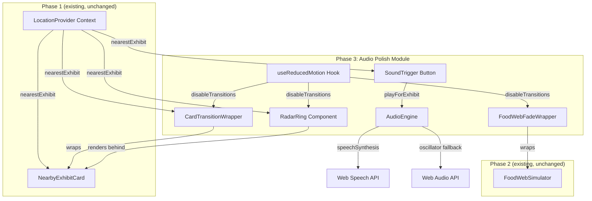
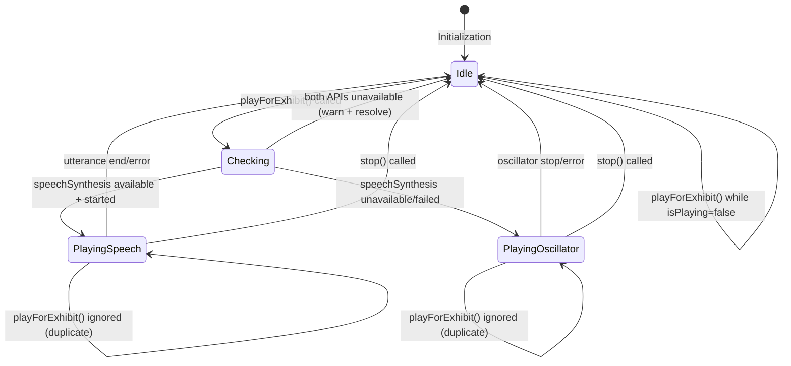

# Design Document: Audio Polish

## Overview

Phase 3 adds two optional enhancement layers to the existing Mandai Wildlife Reserve visitor app:

1. **Placeholder Animal Sound Triggers** — a browser-native audio module that generates placeholder sounds (Web Speech API utterance or Web Audio API oscillator tone) when visitors tap a button on the Nearby Exhibit Card.
2. **Visual Polish Transitions** — Tailwind CSS-only animations including a radar ring pulse, card slide-in transitions, and food web fade effects.

**Key design decisions:**

- **AudioEngine as a standalone module** — encapsulates all Web Speech/Web Audio logic behind a simple async interface. Components call `playForExhibit(name)` without knowing which API is used internally. This isolates browser API complexity and makes the module independently testable via mocks.
- **Tailwind CSS utilities exclusively** — no third-party animation libraries (framer-motion, GSAP, etc.). All visual effects use built-in classes (`animate-ping`, `transition-opacity`, `translate-y`, `duration-300`). Keeps the bundle minimal and avoids version conflicts.
- **Wrapper/enhancement pattern** — Phase 3 components wrap or augment existing Phase 1/Phase 2 components rather than modifying their internals. If Phase 3 fails to load, Phase 1/2 components continue working unchanged.
- **`prefers-reduced-motion` respected globally** — a shared `useReducedMotion()` hook reads the media query once and all transition components subscribe. When enabled, all durations become 0ms (instant show/hide).
- **Silent failure everywhere** — all audio/transition errors are caught and logged via `console.warn`. No error dialogs, toasts, or user-visible failure indicators. The app remains fully interactive regardless of polish module state.

## Architecture



### Data Flow — Audio

1. User taps the `SoundTrigger` button displayed on the `NearbyExhibitCard`.
2. `SoundTrigger` calls `AudioEngine.playForExhibit(exhibitName)`.
3. `AudioEngine` checks its internal `isPlaying` flag — if true, ignores the request.
4. `AudioEngine` attempts `speechSynthesis.speak(utterance)` with the exhibit name.
5. If speechSynthesis is unavailable or throws, `AudioEngine` falls back to creating an `OscillatorNode` (sine wave, 200–800 Hz, 200–1000ms duration).
6. If both APIs fail, `AudioEngine` logs a warning and resolves silently.
7. On completion (utterance `end` event or oscillator timeout), `AudioEngine` resets `isPlaying` to false.

### Data Flow — Visual Transitions

1. `CardTransitionWrapper` wraps the existing `NearbyExhibitCard`. It manages CSS classes for slide-in (`translate-y-full` → `translate-y-0`) on mount and opacity fade on content change.
2. `RadarRing` is a sibling element rendered behind `NearbyExhibitCard` content with `z-index: -1` and Tailwind's `animate-ping` class.
3. `FoodWebFadeWrapper` wraps `FoodWebSimulator` and applies `transition-opacity duration-[400ms]` to nodes/edges as they enter/exit.
4. All transition components read `useReducedMotion()` — if true, they skip adding transition classes (elements appear/disappear instantly).

### Integration Strategy

Phase 3 does NOT modify Phase 1 or Phase 2 component internals. Instead:

- The app's top-level layout composes Phase 3 wrappers around existing components:
  ```
  <CardTransitionWrapper>
    <RadarRing />
    <NearbyExhibitCard />
    <SoundTrigger />
  </CardTransitionWrapper>
  ```
- If Phase 3 fails to initialize (module error), the wrappers either don't render or render transparently, leaving Phase 1/2 components in their baseline state.

## Components and Interfaces

### 1. `AudioEngine` (standalone module)

Encapsulates all audio generation logic. No React dependency — plain TypeScript class.

```typescript
// src/audio/AudioEngine.ts

interface AudioEngineOptions {
  minFrequency?: number;   // default 200 (Hz)
  maxFrequency?: number;   // default 800 (Hz)
  minDuration?: number;    // default 200 (ms)
  maxDuration?: number;    // default 1000 (ms)
}

interface AudioEngineState {
  isPlaying: boolean;
  lastPlayedExhibit: string | null;
  activeMethod: 'speech' | 'oscillator' | null;
  available: boolean; // false if neither API is detected
}

class AudioEngine {
  constructor(options?: AudioEngineOptions);

  /** Returns current engine state (playing, method, availability). */
  getState(): AudioEngineState;

  /**
   * Attempts to play a placeholder audio cue for the given exhibit.
   * Resolves when playback completes or is skipped.
   * Never rejects — all errors are caught and logged.
   */
  playForExhibit(exhibitName: string): Promise<void>;

  /**
   * Stops any in-progress playback and resets state.
   * Called internally on completion or externally for cleanup.
   */
  stop(): void;

  /** Checks browser API availability without triggering playback. */
  static isSupported(): { speech: boolean; oscillator: boolean };
}

export { AudioEngine, AudioEngineOptions, AudioEngineState };
```

**Internal logic:**

1. `playForExhibit(name)`:
   - If `isPlaying` → return immediately (ignore duplicate).
   - Set `isPlaying = true`.
   - Try `speechSynthesis`:
     - Create `SpeechSynthesisUtterance(name)` with default voice, rate, pitch.
     - Call `speechSynthesis.speak(utterance)`.
     - Set timeout for 500ms — if `onstart` hasn't fired, cancel and fall through.
     - On `onend`/`onerror`, reset `isPlaying`.
   - If speech fails, try oscillator:
     - Create `AudioContext` (or reuse existing).
     - Create `OscillatorNode` with `type: 'sine'`.
     - Set `frequency` to a deterministic value derived from the exhibit name (hash modulo range).
     - Connect to `context.destination`, start, schedule stop after computed duration.
     - On stop, reset `isPlaying`.
   - If both fail, `console.warn(...)`, set `isPlaying = false`.

2. `stop()`:
   - Cancel any pending speechSynthesis utterance.
   - Disconnect and stop any active oscillator.
   - Reset `isPlaying = false`.

3. `isSupported()`:
   - Returns `{ speech: 'speechSynthesis' in window, oscillator: 'AudioContext' in window || 'webkitAudioContext' in window }`.

**Frequency derivation**: To give each exhibit a slightly different tone, the oscillator frequency is computed as:
```
hash = simpleStringHash(exhibitName) % (maxFreq - minFreq)
frequency = minFreq + hash
```

### 2. `SoundTrigger` (React component)

Button displayed on the NearbyExhibitCard when an exhibit is within range.

```typescript
// src/components/SoundTrigger.tsx

interface SoundTriggerProps {
  exhibitName: string | null;  // null when no exhibit nearby
  audioEngine: AudioEngine;
}
```

**Behavior:**
- Renders a button with a speaker/sound icon and `aria-label="Play exhibit sound"`.
- Visible only when `exhibitName` is non-null (exhibit within 500m).
- On click, calls `audioEngine.playForExhibit(exhibitName)`.
- While `audioEngine.getState().isPlaying` is true, button shows a subtle "playing" visual state (e.g., pulsing icon via Tailwind `animate-pulse`).
- Disabled/hidden when `exhibitName` is null.
- If `AudioEngine.isSupported()` returns both false, the component does not render.

### 3. `RadarRing` (React component)

Pulsing circular indicator rendered behind the NearbyExhibitCard content.

```typescript
// src/components/RadarRing.tsx

interface RadarRingProps {
  visible: boolean;  // true when nearest exhibit is displayed
  cardDimensions?: { width: number; height: number };
}
```

**Rendering:**
- A `<div>` with Tailwind classes: `absolute rounded-full animate-ping bg-green-400/30`.
- Positioned with `inset-0` or centered via flexbox within the card container.
- Z-index lower than card content: `z-[-1]` or a custom utility.
- Size constrained: `min-w-12 min-h-12` (48px) and `max-w-[50%] max-h-[50%]` relative to the card's smallest dimension.
- When `visible` is false, element is removed from the DOM (`{visible && <RadarRing />}`).
- When `useReducedMotion()` returns true, omits `animate-ping` class (renders static or hidden).

**Tailwind classes used:**
```
animate-ping rounded-full absolute bg-green-400/30 opacity-75
min-w-12 min-h-12 max-w-[50%] max-h-[50%]
```

### 4. `CardTransitionWrapper` (React component)

Wraps the NearbyExhibitCard to add slide-in and content-change transitions.

```typescript
// src/components/CardTransitionWrapper.tsx

interface CardTransitionWrapperProps {
  isVisible: boolean;        // false = no exhibit nearby (card hidden)
  contentKey: string | null; // exhibit id — changes trigger fade transition
  children: React.ReactNode;
}
```

**Behavior:**
- **Slide-in** (appear): When `isVisible` transitions from false → true, the wrapper starts with `translate-y-full opacity-0` and transitions to `translate-y-0 opacity-100` using Tailwind `transition-all duration-300`.
- **Content change fade**: When `contentKey` changes (different exhibit), applies `opacity-0` then immediately transitions to `opacity-100` over 300ms.
- **Disappear**: When `isVisible` transitions from true → false, card slides down (or simply removed).
- **Reduced motion**: When `useReducedMotion()` is true, all classes with `transition-*` and `duration-*` are omitted; `translate-y-0 opacity-100` is applied directly.

**Tailwind classes used:**
```
transition-all duration-300 ease-out
translate-y-full translate-y-0
opacity-0 opacity-100
```

### 5. `FoodWebFadeWrapper` (React component / utility)

Applies fade-in/fade-out effects to food web nodes and edges.

```typescript
// src/components/FoodWebFadeWrapper.tsx

interface FoodWebFadeWrapperProps {
  children: React.ReactNode;
  nodeIds: string[];         // current set of visible node IDs
  previousNodeIds: string[]; // previous set for diff detection
}
```

**Behavior:**
- Tracks which nodes/edges are entering (new in `nodeIds`, not in `previousNodeIds`) and exiting (in `previousNodeIds`, not in `nodeIds`).
- **Entering elements**: Applies `opacity-0 transition-opacity duration-[400ms]` then immediately switches to `opacity-100`.
- **Exiting elements**: Applies `opacity-0 transition-opacity duration-[400ms]`, then removes from DOM after 400ms (via `transitionend` event listener or setTimeout).
- **Interruption**: If an element's transition is interrupted (exit during fade-in or re-add during fade-out), starts new transition from current opacity — achieved by reading `getComputedStyle(el).opacity` before applying new class.
- **Reduced motion**: When `useReducedMotion()` is true, sets `duration-[0ms]` — elements show/hide instantly.

**Tailwind classes used:**
```
opacity-0 opacity-100 transition-opacity duration-[400ms]
```

### 6. `useReducedMotion` (React hook)

Shared hook for detecting `prefers-reduced-motion: reduce`.

```typescript
// src/hooks/useReducedMotion.ts

export function useReducedMotion(): boolean;
```

**Behavior:**
- On mount, evaluates `window.matchMedia('(prefers-reduced-motion: reduce)')`.
- Subscribes to `change` events on the `MediaQueryList` to handle runtime toggling.
- Returns `true` if reduced motion is preferred, `false` otherwise.
- Memoized — multiple components share the same subscription via React's built-in re-render mechanism.

### 7. `useAudioEngine` (React hook)

Provides a singleton AudioEngine instance to components.

```typescript
// src/hooks/useAudioEngine.ts

export function useAudioEngine(): AudioEngine | null;
```

**Behavior:**
- Creates an `AudioEngine` instance on first call (module-level singleton).
- Returns `null` if `AudioEngine.isSupported()` returns both APIs unavailable.
- Calls `audioEngine.stop()` on component unmount for cleanup.

### 8. Integration Composition (App Layout)

The top-level page layout composes Phase 3 enhancements around existing components:

```typescript
// src/pages/ExploreView.tsx (or equivalent layout component)

function ExploreView() {
  const { nearestExhibit } = useLocationContext();
  const audioEngine = useAudioEngine();
  const reducedMotion = useReducedMotion();

  const isExhibitVisible = nearestExhibit !== null;
  const exhibitId = nearestExhibit?.exhibit.id ?? null;
  const exhibitName = nearestExhibit?.exhibit.name ?? null;

  return (
    <div className="relative">
      {/* Phase 3: Card transition wrapper around Phase 1 card */}
      <CardTransitionWrapper
        isVisible={isExhibitVisible}
        contentKey={exhibitId}
      >
        <div className="relative">
          {/* Phase 3: Radar ring behind card content */}
          {isExhibitVisible && !reducedMotion && <RadarRing visible={true} />}
          
          {/* Phase 1: Existing card (unchanged) */}
          <NearbyExhibitCard />
          
          {/* Phase 3: Sound trigger button */}
          {audioEngine && (
            <SoundTrigger
              exhibitName={exhibitName}
              audioEngine={audioEngine}
            />
          )}
        </div>
      </CardTransitionWrapper>

      {/* Phase 2: Food web with fade wrapper */}
      <FoodWebFadeWrapper>
        <FoodWebSimulator exhibits={exhibits} />
      </FoodWebFadeWrapper>
    </div>
  );
}
```

## Data Models

### AudioEngine State

```typescript
interface AudioEngineState {
  isPlaying: boolean;
  lastPlayedExhibit: string | null;
  activeMethod: 'speech' | 'oscillator' | null;
  available: boolean;
}
```

### Audio Support Detection

```typescript
interface AudioSupportResult {
  speech: boolean;     // window.speechSynthesis available
  oscillator: boolean; // AudioContext or webkitAudioContext available
}
```

### Transition State (internal to wrappers)

```typescript
type TransitionPhase = 'entering' | 'visible' | 'exiting' | 'hidden';

interface TransitionState {
  phase: TransitionPhase;
  startedAt: number;  // performance.now() timestamp
}
```

### Exhibit (from Phase 1 — relevant fields)

```typescript
interface Exhibit {
  id: string;
  name: string;        // used as utterance text for speechSynthesis
  lat: number;
  lng: number;
}
```

### Existing Types Reused

```typescript
// From Phase 1 LocationContext
interface ExhibitWithDistance {
  exhibit: Exhibit;
  distance: number; // metres
}

// nearestExhibit: ExhibitWithDistance | null
// — null means no exhibit within 500m → hide SoundTrigger + RadarRing
```

## Error Handling

### Audio Errors

| Scenario | Handling |
|---|---|
| `speechSynthesis` unavailable in browser | Fall back to oscillator. Log `console.warn('speechSynthesis unavailable, using oscillator fallback')` |
| `speechSynthesis.speak()` throws | Catch, fall back to oscillator. Log warning |
| `speechSynthesis` doesn't fire `onstart` within 500ms | Cancel utterance, fall back to oscillator |
| `AudioContext` construction fails | Log `console.warn('Web Audio API unavailable')`. Set `available = false` |
| Both APIs unavailable | Log `console.warn('No audio API available — sound features disabled')`. `SoundTrigger` component does not render |
| Audio cue already playing (duplicate tap) | Ignore silently — return immediately from `playForExhibit()` |
| Audio playback fails mid-stream (decode error) | Catch in `onerror` handler, stop playback, reset `isPlaying = false`, log warning |
| `AudioContext` in suspended state (autoplay policy) | Call `context.resume()` before oscillator start. If resume fails, log warning |

### Transition Errors

| Scenario | Handling |
|---|---|
| CSS transition doesn't fire `transitionend` event | Backup setTimeout (500ms) removes/adds classes regardless |
| `getComputedStyle` throws (rare edge case) | Default to `opacity: 0` and start fresh transition |
| DOM element removed before transition completes | No-op — React's reconciliation handles cleanup |
| `matchMedia` not supported (very old browsers) | `useReducedMotion()` defaults to `false` (animations enabled) |

### Graceful Degradation Matrix

| Failure | Effect on App | Recovery |
|---|---|---|
| Audio module fails to import | `useAudioEngine()` returns `null` → `SoundTrigger` not rendered | Phase 1 card works normally without sound button |
| Transition wrapper throws during render | React error boundary catches → renders children without wrapper | Phase 1/2 components display in baseline state |
| `animate-ping` not supported (CSS) | Ring renders as static element (acceptable degradation) | No action needed |
| `prefers-reduced-motion` query fails | All animations enabled (safe default) | No action needed |

### Error Boundary Pattern

```typescript
// src/components/AudioPolishBoundary.tsx

class AudioPolishBoundary extends React.Component {
  state = { hasError: false };

  static getDerivedStateFromError() {
    return { hasError: true };
  }

  componentDidCatch(error: Error) {
    console.warn('[audio-polish] Module error, falling back to baseline:', error.message);
  }

  render() {
    if (this.state.hasError) {
      // Render children without any Phase 3 enhancements
      return this.props.fallback ?? this.props.children;
    }
    return this.props.children;
  }
}
```

### State Machine — AudioEngine



## Testing Strategy

### Testing Framework

- **Unit Tests**: Vitest + React Testing Library
- **Mocking**: Vitest's built-in `vi.mock()` for Web Speech API and Web Audio API
- **Configuration**: Standard Vitest configuration with jsdom environment

### Why Property-Based Testing Does Not Apply

This feature is **not suitable for property-based testing** because:

1. **Side-effect-only operations**: The AudioEngine's primary purpose is triggering browser audio APIs — these are side effects with no meaningful return value to assert universal properties on.
2. **UI rendering and animations**: RadarRing, CardTransitionWrapper, and FoodWebFadeWrapper are CSS-class-driven visual effects. Their correctness is about which CSS classes are applied to which DOM elements in response to state changes — best verified with example-based component tests.
3. **Deterministic state machine**: The AudioEngine's state transitions (idle → playing → idle) are deterministic and have a small, enumerable input space. Example-based tests covering each transition path provide full coverage more clearly than property-based fuzzing.
4. **No meaningful input variation**: The audio feature takes an exhibit name string and plays a sound. There is no complex input space where randomized testing would reveal edge cases that specific examples wouldn't.

### Unit Tests (Example-Based)

| Requirement | Test Focus | Test File |
|---|---|---|
| 1.1 | `playForExhibit()` resolves within 500ms; mock speechSynthesis fires `onstart` | `AudioEngine.test.ts` |
| 1.2 | When speechSynthesis throws, logs warning and doesn't block | `AudioEngine.test.ts` |
| 1.3 | Falls back to oscillator when `speechSynthesis` is undefined | `AudioEngine.test.ts` |
| 1.4 | Speech utterance uses exhibit name with default voice/rate/pitch | `AudioEngine.test.ts` |
| 1.5 | Oscillator frequency is between 200–800 Hz, duration 200–1000ms | `AudioEngine.test.ts` |
| 1.6 | When both APIs unavailable, logs warning and takes no action | `AudioEngine.test.ts` |
| 1.7 | Duplicate call while playing is ignored (isPlaying guard) | `AudioEngine.test.ts` |
| 1.8 | SoundTrigger visible when exhibit within 500m, hidden otherwise | `SoundTrigger.test.ts` |
| 2.1 | RadarRing renders with `animate-ping` class when exhibit visible | `RadarRing.test.ts` |
| 2.2 | No third-party animation library imports in component | `RadarRing.test.ts` |
| 2.3 | RadarRing removed from DOM when no exhibit nearby | `RadarRing.test.ts` |
| 2.4 | RadarRing z-index is below card content | `RadarRing.test.ts` |
| 2.5 | RadarRing dimensions ≥48px and ≤50% of card | `RadarRing.test.ts` |
| 3.1 | Card slides in from below with `translate-y` transition classes | `CardTransitionWrapper.test.ts` |
| 3.2 | Content change applies opacity fade over 300ms | `CardTransitionWrapper.test.ts` |
| 3.3 | Only Tailwind utility classes used (no library imports) | `CardTransitionWrapper.test.ts` |
| 3.4 | Transition completes within 500ms | `CardTransitionWrapper.test.ts` |
| 3.5 | `prefers-reduced-motion` disables all card transitions | `CardTransitionWrapper.test.ts` |
| 4.1 | Food web nodes fade in with `opacity-0` → `opacity-100` over 400ms | `FoodWebFadeWrapper.test.ts` |
| 4.2 | Exiting nodes fade out and are removed from DOM after 400ms | `FoodWebFadeWrapper.test.ts` |
| 4.3 | Only Tailwind utility classes used | `FoodWebFadeWrapper.test.ts` |
| 4.4 | Interrupted transition starts from current opacity | `FoodWebFadeWrapper.test.ts` |
| 4.5 | `prefers-reduced-motion` sets duration to 0ms | `FoodWebFadeWrapper.test.ts` |
| 5.1 | Exception in audio/animation is caught, logged, app continues | `AudioPolishBoundary.test.ts` |
| 5.2 | No modal/toast/error displayed to user on failure | `AudioPolishBoundary.test.ts` |
| 5.3 | Controls remain responsive (<200ms) during playback | `SoundTrigger.test.ts` |
| 5.4 | Module init failure renders Phase 1/2 in baseline state | `AudioPolishBoundary.test.ts` |
| 5.5 | Failed playback resets SoundTrigger to idle state | `AudioEngine.test.ts` |

### Integration Tests

| Scenario | Coverage |
|---|---|
| Exhibit comes into range → card slides in → radar ring appears → sound trigger visible | Requirements 1.8, 2.1, 3.1 |
| Tap sound trigger → audio plays → tap again (ignored) → audio ends → trigger idle | Requirements 1.1, 1.7, 5.5 |
| Exhibit changes → card content fades → new info displayed | Requirements 3.2 |
| Enable reduced motion → navigate to exhibit → no animations, instant display | Requirements 3.5, 4.5 |
| Food web filter change → exiting nodes fade out → new nodes fade in | Requirements 4.1, 4.2 |
| Both audio APIs mocked as unavailable → sound trigger not rendered → card still works | Requirements 1.6, 5.4 |
| AudioEngine throws during playback → app remains responsive | Requirements 5.1, 5.3 |

### Mock Strategy

| Browser API | Mock Approach |
|---|---|
| `window.speechSynthesis` | `vi.stubGlobal('speechSynthesis', { speak: vi.fn(), cancel: vi.fn() })` with configurable event callbacks |
| `AudioContext` / `OscillatorNode` | Mock class with `createOscillator()`, `connect()`, `start()`, `stop()` as vi.fn() |
| `window.matchMedia` | `vi.stubGlobal('matchMedia', vi.fn(() => ({ matches: false, addEventListener: vi.fn() })))` |
| `getComputedStyle` | Mock to return controlled opacity values for transition interruption tests |

### Test File Structure

```
src/
├── audio/
│   └── __tests__/
│       └── AudioEngine.test.ts              # unit tests (Req 1.1–1.7, 5.5)
├── components/
│   └── __tests__/
│       ├── SoundTrigger.test.ts             # unit tests (Req 1.8, 5.3)
│       ├── RadarRing.test.ts                # unit tests (Req 2.1–2.5)
│       ├── CardTransitionWrapper.test.ts    # unit tests (Req 3.1–3.5)
│       ├── FoodWebFadeWrapper.test.ts       # unit tests (Req 4.1–4.5)
│       ├── AudioPolishBoundary.test.ts      # unit + integration tests (Req 5.1–5.4)
│       └── AudioPolishIntegration.test.ts   # integration tests (full flows)
├── hooks/
│   └── __tests__/
│       ├── useReducedMotion.test.ts         # unit tests
│       └── useAudioEngine.test.ts           # unit tests
```
