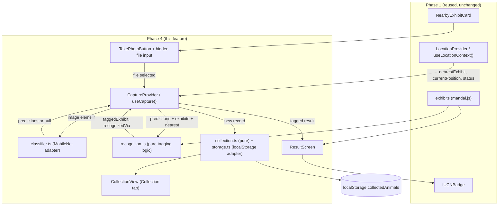
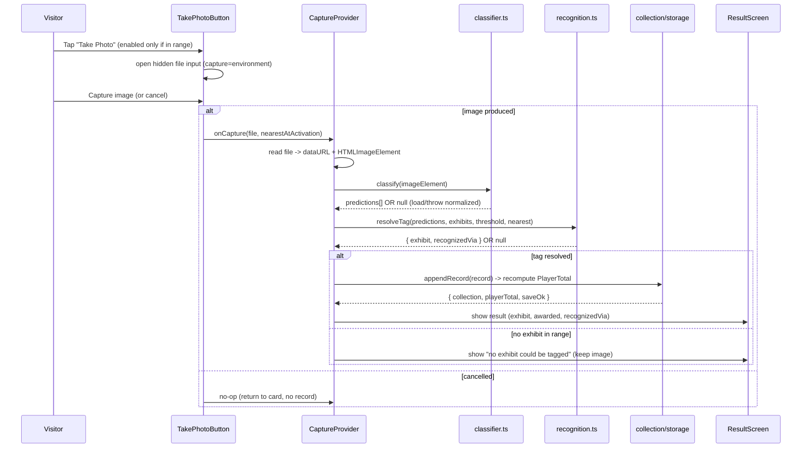

# Design Document: Checkpoint Photo Capture & Animal Recognition

## Overview

This feature implements Phase 4 of the Mandai Wildlife Reserve visitor app. When a visitor is in range of an exhibit, the app presents a Take Photo action on the (Phase 1) Nearby Exhibit Card. Activating it opens the device's native camera. The captured image is classified on-device with a MobileNet model (TensorFlow.js) and matched against each exhibit's `imagenetLabels`. When classification is inconclusive or fails, the app tags the exhibit the visitor is currently nearest to, so a live demo never dead-ends. On a successful tag the app shows a Result Screen with the exhibit's fun fact, diet, and IUCN status, awards the exhibit's points exactly once per exhibit, and persists the record to `localStorage` so progress survives a refresh.

This feature is a strict consumer of Phase 1 (location-aware-exhibit-discovery). It **reuses** `LocationProvider` / `useLocationContext()` for `nearestExhibit`, `currentPosition`, and `status`, and **reuses** exhibit data and the `IUCNBadge` component. It does not reimplement any location, distance, or geolocation logic.

**Key design decisions:**
- **Separate the pure logic from the effectful shell.** Recognition/tagging, points accounting, and record parsing are pure, deterministic modules (fully property-testable). The classifier (TensorFlow.js), the camera file input, and `localStorage` are thin effectful adapters at the edges.
- **Native camera only.** Capture uses a hidden `<input type="file" accept="image/*" capture="environment">`. No custom camera preview UI is built (Req 2.2).
- **Fallback is a first-class path, not an error path.** A classifier that fails to load, throws, or produces no confident match is normalized into "no classifier match," which routes to location-fallback tagging (Req 3.4, 4.1, 4.4). The flow only shows a "cannot tag" message when there is genuinely no exhibit in range (Req 4.5).
- **Points are derived, never trusted from storage.** `Player_Total` is always recomputed as the sum of `points` over the *distinct* exhibit ids in the collection, so deduplication is a property of the derivation rather than mutable running state (Req 5, 7.3).
- **New dependencies:** `@tensorflow/tfjs` and `@tensorflow-models/mobilenet` (not currently in `package.json`; added by this feature). Everything else (React 18, Vitest, fast-check, React Testing Library) is already present.

## Architecture



### Capture Sequence



### Layering

1. **Pure core (no I/O, deterministic):** `recognition.ts`, `collection.ts`. These take plain data in and return plain data out. All correctness properties target this layer.
2. **Effectful adapters:** `classifier.ts` (TensorFlow.js), `storage.ts` (`localStorage`), and the file-input/`FileReader` glue inside the capture hook. These are mocked in tests.
3. **UI + orchestration:** `CaptureProvider`/`useCapture`, `TakePhotoButton`, `ResultScreen`, `CollectionView`, and the extension of `NearbyExhibitCard`.

## Components and Interfaces

### 1. `classifier.ts` — MobileNet adapter (effectful)

Wraps TensorFlow.js + MobileNet. Loads the model lazily/once, classifies an image, and normalizes all failures to `null` so the caller can route to fallback without special-casing (Req 3.4, 3.5, 4.4).

```typescript
// src/engine/classifier.ts
import type { Prediction } from '../types';

/**
 * Ranked predictions for an image, or null if classification is unavailable
 * (model failed to load, threw, or produced nothing). Never rejects.
 * Runs entirely in-browser; the image is never sent to any external service.
 */
export interface Classifier {
  classify(image: HTMLImageElement): Promise<Prediction[] | null>;
}

/** Lazily loads MobileNet once; subsequent calls reuse the loaded model. */
export function createMobileNetClassifier(): Classifier;
```

- Uses `@tensorflow-models/mobilenet` `load()` then `model.classify(image)`, mapping results to `{ className, probability }[]`.
- A load or classify error is caught and returned as `null` (never thrown) — Req 3.4, 4.4.
- The model is cached in module scope so repeated captures do not reload it.

### 2. `recognition.ts` — tagging logic (pure)

Given classifier predictions, the exhibits dataset, a confidence threshold, and the current `nearestExhibit`, decide which exhibit the image is tagged to and how.

```typescript
// src/engine/recognition.ts
import type { Exhibit, ExhibitWithDistance, Prediction, RecognitionMethod } from '../types';

export const DEFAULT_CONFIDENCE_THRESHOLD = 0.6;

export interface TagResult {
  exhibit: Exhibit;
  recognizedVia: RecognitionMethod; // 'classifier' | 'location-fallback'
}

/**
 * Find the highest-confidence prediction whose label case-insensitively
 * exactly matches a label in some exhibit's imagenetLabels. On a confidence
 * tie, the exhibit appearing first in `exhibits` order wins (Req 3.2).
 * Returns null when no prediction matches any exhibit label.
 */
export function matchExhibitByLabel(
  predictions: Prediction[] | null,
  exhibits: Exhibit[],
): { exhibit: Exhibit; probability: number } | null;

/**
 * Resolve the final tag.
 *  - If a label match exists with probability >= threshold -> classifier tag (Req 3.3).
 *  - Otherwise, if nearestExhibit is non-null -> location-fallback tag (Req 4.1, 4.2).
 *  - Otherwise -> null (no exhibit could be tagged; Req 4.5).
 * `predictions === null` (classifier unavailable) is treated as no match (Req 3.4, 4.4).
 */
export function resolveTag(
  predictions: Prediction[] | null,
  exhibits: Exhibit[],
  nearestExhibit: ExhibitWithDistance | null,
  threshold?: number, // default DEFAULT_CONFIDENCE_THRESHOLD
): TagResult | null;
```

### 3. `collection.ts` — collection logic (pure)

Parsing, validation, appending, and points derivation. No `localStorage` access here.

```typescript
// src/engine/collection.ts
import type { Exhibit, CollectedRecord } from '../types';

/** True if a record has all required fields with valid types (Req 7.5). */
export function isValidRecord(value: unknown): value is CollectedRecord;

/**
 * Parse the raw localStorage string into a list of valid records.
 * Unparseable-as-a-whole -> [] (Req 7.4). Individual invalid records are
 * dropped (Req 7.5).
 */
export function parseCollection(raw: string | null): CollectedRecord[];

/** Append a record, returning a new array (pure; no mutation). */
export function appendRecord(
  collection: CollectedRecord[],
  record: CollectedRecord,
): CollectedRecord[];

/**
 * Player_Total = sum of `points` over the DISTINCT exhibit ids present in the
 * collection (Req 5.1-5.3, 7.3). Exhibits whose points are missing or outside
 * 0..999999 contribute 0 (Req 5.4).
 */
export function computePlayerTotal(
  collection: CollectedRecord[],
  exhibits: Exhibit[],
): number;

/**
 * Whether tagging `exhibitId` would award points for the first time
 * (its id is not already present in the collection) (Req 5.1-5.3).
 */
export function isFirstTag(collection: CollectedRecord[], exhibitId: string): boolean;

/** True if the exhibit's points value is missing or outside 0..999999 (Req 5.4). */
export function isPointsAwardable(exhibit: Exhibit | undefined): boolean;
```

### 4. `storage.ts` — persistence adapter (effectful)

Thin wrapper over `localStorage` under the key `collectedAnimals`. Read never throws (returns `null` on any failure → parsed as empty). Write returns success/failure so the UI can surface a save warning without discarding data (Req 7.2).

```typescript
// src/engine/storage.ts
export const COLLECTED_ANIMALS_KEY = 'collectedAnimals';

export function readRawCollection(): string | null; // null on any error
export function writeCollection(json: string): boolean; // false on quota/serialize error
```

### 5. `CaptureProvider` / `useCapture()` — orchestration (React context + hook)

Owns capture phase state and the collection, orchestrating capture → classify → tag → persist → result. Consumes `useLocationContext()` for `nearestExhibit` and `currentPosition`; it does not read geolocation directly.

```typescript
// src/context/CaptureContext.tsx
import type { CollectedRecord, Exhibit, RecognitionMethod } from '../types';

export type CapturePhase = 'idle' | 'classifying' | 'result' | 'error';

export interface CaptureResult {
  exhibit: Exhibit;
  recognizedVia: RecognitionMethod;
  pointsAwarded: number;  // 0 when duplicate or not awardable
  firstTag: boolean;
  saveOk: boolean;        // false if the localStorage write failed (Req 7.2)
}

export interface CaptureContextValue {
  phase: CapturePhase;
  cameraUnavailable: boolean;   // Req 1.7 / 2.x camera could not open
  result: CaptureResult | null;
  collection: CollectedRecord[];
  playerTotal: number;
  /** Called by the capture handler once a File is produced. */
  handleCapturedFile: (file: File) => Promise<void>;
  /** Called when the native input is opened but returns no file (Req 2.4). */
  handleCaptureCancelled: () => void;
  /** Signal that the camera could not be opened (Req 1.7). */
  reportCameraUnavailable: () => void;
  /** Dismiss the result screen and return to the card. */
  dismissResult: () => void;
}

export function CaptureProvider(props: {
  classifier?: Classifier;   // injectable for tests; defaults to MobileNet adapter
  children: React.ReactNode;
}): JSX.Element;

export function useCapture(): CaptureContextValue;
```

Orchestration steps inside `handleCapturedFile`:
1. Read `File` → data URL and an `HTMLImageElement` (via `FileReader` + `Image`).
2. Capture `nearestExhibit` at activation time as the fallback target (Req 1.5).
3. `phase = 'classifying'`; call `classifier.classify(image)` (returns predictions or null).
4. `resolveTag(predictions, exhibits, nearestAtActivation, threshold)`.
5. If null → `phase = 'error'`, keep the image (Req 4.5). Otherwise build a `CollectedRecord`.
6. Compute `firstTag` and `pointsAwarded` (0 if duplicate or not awardable), append record, recompute `playerTotal`, attempt `writeCollection` (track `saveOk`).
7. `phase = 'result'` with the `CaptureResult`.

### 6. `TakePhotoButton` — capture trigger (UI)

Rendered inside the extended `NearbyExhibitCard`. Enabled only when `nearestExhibit` is non-null (in range); disabled otherwise (Req 1.1, 1.2, 1.6). Owns the hidden native file input.

```typescript
// src/components/TakePhotoButton.tsx
export function TakePhotoButton(): JSX.Element;
// Internally:
//  - reads nearestExhibit from useLocationContext() to compute disabled state
//  - <input type="file" accept="image/*" capture="environment" hidden />
//  - onClick: if enabled, input.click(); else no-op (Req 1.6)
//  - onChange: file present -> useCapture().handleCapturedFile(file)
//              no file      -> useCapture().handleCaptureCancelled()
```

`NearbyExhibitCard` is extended to render `<TakePhotoButton />` in its footer. The card's existing "No exhibit nearby" branch continues to render (with the button absent or disabled), so the card contents are retained unchanged when out of range (Req 1.6).

### 7. `ResultScreen` — post-tag result (UI)

Shows the tagged exhibit's fun fact, diet, and IUCN status (via the reused `IUCNBadge`), plus points awarded on a first tag. Identical fields regardless of `recognizedVia` (Req 6.1–6.3). When `recognizedVia === 'location-fallback'` and the classifier was unavailable, it additionally shows a subtle "recognition unavailable" note (Req 4.4).

```typescript
// src/components/ResultScreen.tsx
export interface ResultScreenProps {
  result: CaptureResult;
  onDismiss: () => void;
}
export function ResultScreen(props: ResultScreenProps): JSX.Element;
```

### 8. `CollectionView` — Collection tab (UI)

A new tab in the App shell listing `Collected_Animals` (exhibit name, IUCN badge, recognized-via, timestamp) and showing `playerTotal`.

```typescript
// src/components/CollectionView.tsx
export function CollectionView(): JSX.Element; // consumes useCapture()
```

### 9. App shell integration

`App.tsx` wraps the tree with `CaptureProvider` *inside* `LocationProvider` (so capture can consume location), adds a third tab `'collection'`, and renders `ResultScreen` as an overlay when `phase === 'result'` or the camera-unavailable / no-tag messages when appropriate.

```
<LocationProvider>
  <CaptureProvider>
    <AppShell />   // tabs: Nearby Exhibit | Facilities | Collection
  </CaptureProvider>
</LocationProvider>
```

## Data Models

### Prediction (classifier output)

```typescript
// src/types/index.ts (added)
export interface Prediction {
  className: string;   // e.g. "hippopotamus, hippo" or "tiger"
  probability: number; // 0.0 .. 1.0
}
```

Note: MobileNet class names can be comma-separated synonym lists. Label matching compares each exhibit `imagenetLabels` entry case-insensitively against the prediction's `className`; matching also splits the prediction `className` on commas and trims, so `"hippopotamus, hippo"` matches an exhibit label `"hippo"`.

### RecognitionMethod

```typescript
export type RecognitionMethod = 'classifier' | 'location-fallback';
```

### CollectedRecord

```typescript
export interface CollectedRecord {
  photo: string;                 // data URL of the captured image
  exhibitId: string;             // tagged exhibit id
  recognizedVia: RecognitionMethod;
  timestamp: number;             // ms since Unix epoch
}
```

A record is **valid** (Req 7.5) iff: `photo` is a non-empty string, `exhibitId` is a non-empty string, `recognizedVia` is one of the two allowed values, and `timestamp` is a finite number.

### Reused Phase 1 types

`Exhibit`, `ExhibitWithDistance`, `Position` are imported from `src/types/index.ts` (Phase 1). `exhibits` is imported from `src/data/mandai.js`. `Exhibit.points` and `Exhibit.imagenetLabels` (already defined) drive points accounting and label matching.

### Persistence shape

`localStorage['collectedAnimals']` holds `JSON.stringify(CollectedRecord[])`. `Player_Total` is **not** persisted; it is derived on every load and after every append via `computePlayerTotal` (Req 7.3).

## Correctness Properties

*A property is a characteristic or behavior that should hold true across all valid executions of a system — essentially, a formal statement about what the system should do. Properties serve as the bridge between human-readable specifications and machine-verifiable correctness guarantees.*

The properties below target the pure logic modules (`recognition.ts`, `collection.ts`), where behavior varies richly with input. UI gating, timing budgets (1s/3s), attribute configuration, the effectful classifier call, and `localStorage` failure handling are covered by example, integration, and smoke tests in the Testing Strategy rather than by properties.

### Property 1: Classifier match selection is argmax over matching labels with dataset-order tiebreak

*For any* array of exhibits and *for any* list of predictions, `matchExhibitByLabel` SHALL return either `null` (when no prediction's `className` case-insensitively exactly matches any label in any exhibit's `imagenetLabels`) or a `{ exhibit, probability }` where: (a) the returned `probability` equals the maximum probability among all predictions that match some exhibit label, and (b) among predictions tied at that maximum probability, the chosen `exhibit` is the one appearing earliest in the `exhibits` array.

**Validates: Requirements 3.2**

### Property 2: A confident match produces a classifier tag to the owning exhibit

*For any* exhibits, `nearestExhibit`, and threshold `T` in [0,1], IF the highest-confidence matching prediction has probability ≥ `T`, THEN `resolveTag` SHALL return `{ exhibit, recognizedVia: 'classifier' }` where `exhibit` is the exhibit that owns the matched label.

**Validates: Requirements 3.3**

### Property 3: Missing or unusable classifier output is normalized to "no match"

*For any* exhibits, `nearestExhibit`, and threshold, `resolveTag(null, exhibits, nearestExhibit, T)` SHALL return exactly the same `TagResult` (or `null`) as `resolveTag([], exhibits, nearestExhibit, T)`. That is, an unavailable/thrown classifier behaves identically to a classifier that produced no matching prediction, never a distinct failure outcome.

**Validates: Requirements 3.4, 4.4**

### Property 4: Absent a confident match, tagging falls back to the nearest exhibit

*For any* exhibits, threshold `T`, and non-null `nearestExhibit`, IF no matching prediction has probability ≥ `T` (including when predictions is `null` or empty), THEN `resolveTag` SHALL return `{ exhibit: nearestExhibit.exhibit, recognizedVia: 'location-fallback' }`.

**Validates: Requirements 4.1, 4.2**

### Property 5: No confident match and no nearest exhibit yields no tag

*For any* exhibits and threshold `T`, IF no matching prediction has probability ≥ `T` AND `nearestExhibit` is `null`, THEN `resolveTag` SHALL return `null`.

**Validates: Requirements 4.5**

### Property 6: Player_Total equals the sum of points over distinct awardable exhibits

*For any* collection of records and *for any* exhibits dataset, `computePlayerTotal` SHALL equal the sum of `points` taken over the set of *distinct* exhibit ids present in the collection that both (a) correspond to a known exhibit and (b) have a `points` value that is present and within 0..999999; ids that are unknown or whose points are missing/out-of-range SHALL contribute 0.

**Validates: Requirements 5.1, 5.3, 5.4, 7.3**

### Property 7: Re-tagging an already-collected exhibit does not change Player_Total

*For any* collection that already contains a record for `exhibitId`, and *for any* new record for that same `exhibitId`, `computePlayerTotal(appendRecord(collection, record), exhibits)` SHALL equal `computePlayerTotal(collection, exhibits)`, while the collection length increases by exactly one.

**Validates: Requirements 5.2**

### Property 8: Parsing keeps exactly the valid records and drops the rest

*For any* array formed by interleaving valid records with invalid ones (missing `photo`, `exhibitId`, `recognizedVia`, or `timestamp`, or with an out-of-enum `recognizedVia`), `parseCollection(JSON.stringify(array))` SHALL return exactly the sublist of valid records in their original order. For *any* input that is `null` or not parseable as a JSON array, `parseCollection` SHALL return `[]`.

**Validates: Requirements 7.4, 7.5, 7.6**

### Property 9: Valid records survive a serialize/parse round-trip unchanged

*For any* list of valid `CollectedRecord` values, `parseCollection(JSON.stringify(records))` SHALL deep-equal `records`.

**Validates: Requirements 7.1**

## Error Handling

### Classifier failures (normalized, never a dead-end)

| Scenario | Handling |
|---|---|
| MobileNet model fails to load | `classify` returns `null` → `resolveTag` treats as no match → location-fallback (Req 3.4, 4.4) |
| `model.classify` throws | Caught, returns `null` → location-fallback with "recognition unavailable" note (Req 4.4) |
| Predictions present but none match a label | `matchExhibitByLabel` returns `null` → location-fallback (Req 4.1) |
| Matching label present but below threshold | Treated as no confident match → location-fallback (Req 4.1) |
| No confident match AND `nearestExhibit === null` | `resolveTag` returns `null` → show "no exhibit could be tagged", retain image (Req 4.5) |

### Camera / capture failures

| Scenario | Handling |
|---|---|
| Camera cannot be opened (no camera / permission denied) | Show "camera unavailable" message, card contents unchanged (Req 1.7) |
| Native input closed with no file | Return to card, create no record (Req 2.4) |
| Take Photo activated while out of range | No-op; button stays disabled; card unchanged (Req 1.6) |

### Persistence failures

| Scenario | Handling |
|---|---|
| `localStorage['collectedAnimals']` absent | `readRawCollection` → `null` → `parseCollection` → `[]`, `playerTotal = 0` (Req 7.4) |
| Stored value not parseable as a JSON array | `parseCollection` → `[]`, `playerTotal = 0` (Req 7.4) |
| Individual record missing required fields | Excluded from collection and from `playerTotal` (Req 7.5) |
| `writeCollection` throws (quota/serialize) | Returns `false` → keep in-memory record, set `saveOk = false`, show save-incomplete note, still show Result Screen, no prior data lost (Req 7.2) |
| Points missing or outside 0..999999 | Record created, `playerTotal` unchanged, "no points awarded" indication (Req 5.4) |

### Points accounting

- `Player_Total` is always **derived** via `computePlayerTotal`, never mutated in place, so duplicate tags cannot double-award (Req 5.2) and the total is self-healing on reload.

## Testing Strategy

### Frameworks

- **Unit & property tests:** Vitest + `fast-check` (already in `devDependencies`). Each property test runs a minimum of **100 iterations**.
- **Component tests:** Vitest + React Testing Library + `@testing-library/jest-dom` (already present).
- **Mocks:** TensorFlow.js / MobileNet is mocked via an injected `Classifier` (the `CaptureProvider` accepts a `classifier` prop); `localStorage` is stubbed/spied per test; timers are used where a timing budget is asserted.

### Why property-based testing applies here

The recognition/tagging decision and the collection points/parsing logic are pure functions over large, structured input spaces (arbitrary prediction lists, exhibit datasets, mixed valid/invalid records). They have clear universal invariants (argmax selection, null-normalization, distinct-sum points, parse/round-trip), so PBT is the right tool. The classifier I/O, camera input, `localStorage` effects, UI rendering, and the 1s/3s timing budgets are **not** suited to PBT and use integration/example/smoke tests instead.

### Property test mapping

| Property | Module | Test file | Generator strategy |
|---|---|---|---|
| P1 Match selection | `recognition.ts` | `recognition.property.test.ts` | Random `Prediction[]` (some className mutated in case to match exhibit labels) + random exhibit arrays; assert argmax + earliest-exhibit tiebreak |
| P2 Confident classifier tag | `recognition.ts` | `recognition.property.test.ts` | Inject a matching prediction with `prob ≥ T`; assert `classifier` tag to owning exhibit |
| P3 Null normalization | `recognition.ts` | `recognition.property.test.ts` | Compare `resolveTag(null,...)` vs `resolveTag([],...)` for random exhibits/nearest/threshold |
| P4 Fallback tag | `recognition.ts` | `recognition.property.test.ts` | Predictions with all matching probs `< T` (or none) + non-null nearest |
| P5 No tag | `recognition.ts` | `recognition.property.test.ts` | Non-confident predictions + `nearest = null` |
| P6 Distinct-sum total | `collection.ts` | `collection.property.test.ts` | Random records (repeating ids) + exhibits with random/out-of-range points |
| P7 Duplicate no-change | `collection.ts` | `collection.property.test.ts` | Collection containing id X + append another X record |
| P8 Parse valid subset | `collection.ts` | `collection.property.test.ts` | Interleave valid + invalid records; also arbitrary non-JSON strings |
| P9 Round-trip | `collection.ts` | `collection.property.test.ts` | Arbitrary valid `CollectedRecord[]` |

**Tag format** — each property test is annotated:
```
// Feature: checkpoint-photo-capture, Property N: <property text>
```

### Unit / example tests

| Requirement | Focus |
|---|---|
| 1.1, 1.2 | Button enabled/disabled from `nearestExhibit` presence |
| 1.3, 1.6 | Enabled click opens input; disabled click is a no-op |
| 1.7 | Camera-unavailable message; card retained |
| 2.1 | Input has `accept="image/*"` and `capture="environment"` (smoke) |
| 2.2 | No custom camera preview UI rendered |
| 2.4 | Cancelled capture creates no record |
| 5.4, 6.1, 6.2, 6.3 | Result Screen fields; points-awarded on first tag; identical fields for fallback vs classifier |

### Integration tests

| Scenario | Coverage |
|---|---|
| Capture → mocked confident classifier → classifier tag → result shown | Req 3.1, 3.3, 4.3, 6.1 |
| Capture → mocked classifier returns null/throws → fallback tag + "recognition unavailable" | Req 3.4, 4.4 |
| Capture with no exhibit in range → "no exhibit could be tagged", image retained | Req 4.5 |
| `nearestExhibit` at activation snapshotted as fallback target | Req 1.5 |
| First-vs-duplicate tag → points awarded once, total stable | Req 5.1, 5.2 |
| `writeCollection` fails → `saveOk=false`, result still shown, no data lost | Req 7.2 |
| App load restores valid records and derives `playerTotal` | Req 7.3 |

### Performance notes

- **1-second gating (Req 1.1, 1.2):** enabled/disabled state derives synchronously from context, so it updates on the same React commit as the position update — well within budget. Verified via example tests rather than wall-clock assertions.
- **3-second tagging (Req 4.3):** with a mocked (instant) classifier, integration tests assert the result renders synchronously after capture. The real MobileNet inference budget is validated manually during a device demo; the design keeps the model loaded once (module-scoped cache) so only first-load latency is incurred, not per-capture.
- **`src/test/smoke.test.ts`** remains the environment sanity check.
