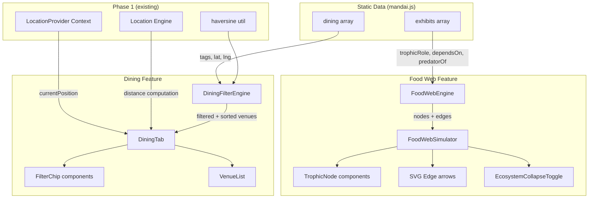
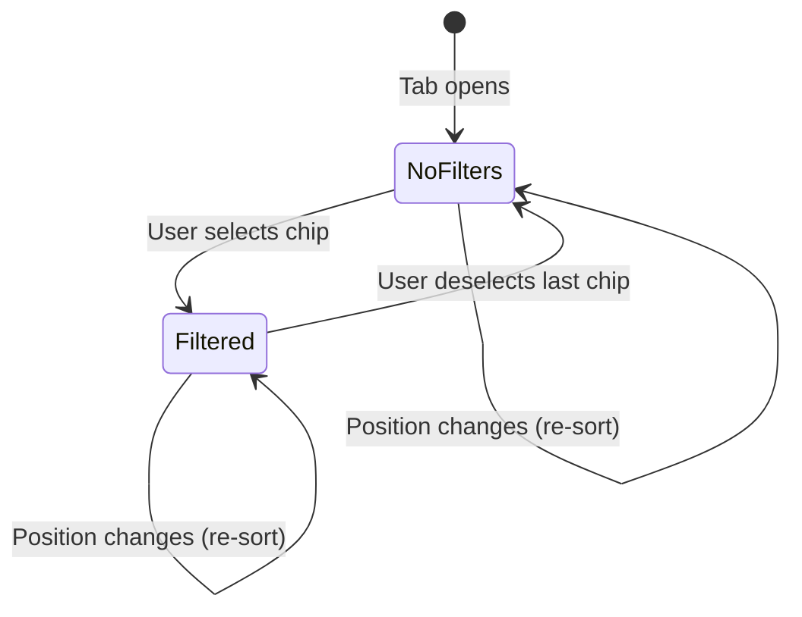

# Design Document: Food Web & Dining

## Overview

Phase 2 adds two visitor-facing features to the Mandai Wildlife Reserve app:

1. **Trophic Food Web Simulator** — an interactive SVG-based node diagram that visualizes ecological relationships between exhibits. Visitors can toggle an "Ecosystem Collapse" mode to see cascading impact when a species is removed.
2. **Dining Tab** — a filterable, distance-sorted list of dining venues. Visitors select tag-based filter chips (Halal, Vegetarian, Air-Conditioned, Kid-Friendly) and see venues narrowed with AND logic, sorted by proximity via the Phase 1 Location Engine.

**Key design decisions:**

- **Custom SVG rendering** for the food web — the dataset is small (~10 nodes), trophic levels provide a natural 3-row layout, and a library-free approach keeps the bundle minimal for a hackathon project.
- **Pure data-extraction module** (`foodWebEngine.ts`) to derive graph nodes and edges from existing exhibit fields — easily testable, decoupled from rendering.
- **CSS opacity transitions** for ecosystem collapse — no physics/animation engine, meets the 400ms transition requirement with minimal code.
- **Reuse Phase 1's `LocationProvider`** — the Dining Tab subscribes to the same context for distance computation, avoiding duplication.
- **Local component state** for filter chip selection — lightweight, no need for additional context providers since filter state is scoped to the Dining Tab.

## Architecture



### Data Flow — Food Web

1. `FoodWebEngine.extractGraph(exhibits)` reads `trophicRole`, `dependsOn`, and `predatorOf` from each exhibit to produce a list of nodes and directed edges.
2. `FoodWebSimulator` receives the graph data and renders nodes positioned in 3 horizontal tiers (Producers bottom, Primary Consumers middle, Apex Predators top).
3. When ecosystem collapse is toggled on a node, the component applies CSS `opacity: 0.3` to the selected node and all dependents, and displays `ecosystemImpactIfRemoved` text overlays.

### Data Flow — Dining

1. `DiningTab` subscribes to `LocationProvider` for `currentPosition`.
2. `DiningFilterEngine.filterAndSort(venues, activeFilters, position)` applies AND-logic tag filtering, computes Haversine distances using the existing `haversine` util, and returns venues sorted by ascending distance.
3. `FilterChip` components toggle tags in local state; each state change triggers a re-filter/re-sort.

## Components and Interfaces

### 1. `FoodWebEngine` (pure computation module)

Extracts graph structure from exhibit data. No React dependency.

```typescript
// src/engine/foodWebEngine.ts

interface TrophicNode {
  id: string;
  label: string;
  trophicLevel: 'Producer' | 'Primary Consumer' | 'Apex Predator';
  exhibitId: string | null; // null for inferred producer nodes
}

interface TrophicEdge {
  from: string; // source node id (energy source)
  to: string;   // target node id (consumer)
}

interface FoodWebGraph {
  nodes: TrophicNode[];
  edges: TrophicEdge[];
  warnings: string[]; // exhibits with unrecognized trophicRole
}

export function extractGraph(exhibits: Exhibit[]): FoodWebGraph;

export function findDependents(
  graph: FoodWebGraph,
  removedNodeId: string
): string[]; // ids of nodes that depend on the removed node
```

**`extractGraph` logic:**
1. For each exhibit with a valid `trophicRole`, create a `TrophicNode` with `exhibitId` set.
2. For each unique entry in any exhibit's `dependsOn` array that is not already a node, create an inferred Producer node (label = dependency name, `exhibitId` = null).
3. For each exhibit, create edges from each `dependsOn` entry → the exhibit (energy flows upward).
4. For each exhibit, create edges from each entry in `predatorOf` → the exhibit (predator consumes prey).
5. Exhibits with `trophicRole` not in the valid set are excluded; their names are added to `warnings`.

**`findDependents` logic:**
1. Given a removed node ID, traverse edges to find all nodes whose `dependsOn` relationship includes the removed node.
2. Return the list of dependent node IDs.

### 2. `FoodWebSimulator` (React component)

The main graph visualization container.

```typescript
// src/components/FoodWebSimulator.tsx

interface FoodWebSimulatorProps {
  exhibits: Exhibit[];
}

interface FoodWebSimulatorState {
  selectedNodeId: string | null;
  collapseActive: boolean;
}
```

**Rendering approach:**
- Uses an SVG viewport with fixed dimensions (responsive via `viewBox`).
- Nodes are positioned using a deterministic layout algorithm:
  - Y-position by trophic level: Producers at bottom (y=80%), Primary Consumers at middle (y=50%), Apex Predators at top (y=20%).
  - X-position: evenly distributed within each level row.
- Edges rendered as SVG `<path>` elements with arrowhead `<marker>` definitions.
- Each node is a `<g>` group containing a circle and label text.

**Collapse behavior:**
- When `collapseActive` is true and `selectedNodeId` is set, the component applies `opacity: 0.3` via inline style with `transition: opacity 400ms ease` to the selected node and all its dependents.
- Displays `ecosystemImpactIfRemoved` text for each affected exhibit in an overlay panel.

### 3. `TrophicNode` (React component)

Presentational node element within the SVG.

```typescript
// src/components/TrophicNode.tsx

interface TrophicNodeProps {
  node: TrophicNode;
  x: number;
  y: number;
  dimmed: boolean;
  selected: boolean;
  onSelect: (nodeId: string) => void;
}
```

**Renders:**
- SVG `<circle>` with radius based on node type (larger for exhibits, smaller for inferred producers).
- `<text>` label below the circle.
- `opacity` style driven by `dimmed` prop with CSS transition.
- Click handler calls `onSelect`.

### 4. `EcosystemCollapseToggle` (React component)

Toggle control for collapse simulation mode.

```typescript
// src/components/EcosystemCollapseToggle.tsx

interface EcosystemCollapseToggleProps {
  active: boolean;
  selectedNodeLabel: string | null;
  onToggle: () => void;
}
```

**Behavior:**
- Renders a toggle switch/button labeled "Simulate Ecosystem Collapse".
- Disabled state when no node is selected.
- When activated, triggers the parent to apply dimming to dependents.

### 5. `DiningFilterEngine` (pure computation module)

Handles filtering and sorting logic for dining venues. No React dependency.

```typescript
// src/engine/diningFilterEngine.ts

type DiningTag = 'halal' | 'vegetarian' | 'air-conditioned' | 'kid-friendly';

interface DiningVenueWithDistance {
  venue: DiningVenue;
  distance: number; // metres, rounded to nearest whole
}

export function filterAndSort(
  venues: DiningVenue[],
  activeFilters: DiningTag[],
  position: Position | null
): DiningVenueWithDistance[];

export function filterByTags(
  venues: DiningVenue[],
  activeFilters: DiningTag[]
): DiningVenue[];

export function sortByDistance(
  venues: DiningVenue[],
  position: Position
): DiningVenueWithDistance[];
```

**`filterByTags` logic:**
- If `activeFilters` is empty, return all venues unchanged.
- Otherwise, return only venues where `venue.tags` includes **every** tag in `activeFilters` (AND logic).

**`sortByDistance` logic:**
- Compute Haversine distance from `position` to each venue's `(lat, lng)`.
- Round each distance to the nearest whole metre.
- Sort ascending by distance; ties preserve original dataset order (stable sort).

**`filterAndSort` logic:**
1. Apply `filterByTags`.
2. If `position` is non-null, apply `sortByDistance`. Otherwise, return in dataset order.

### 6. `DiningTab` (React component)

The main dining view. Subscribes to `LocationProvider` context.

```typescript
// src/components/DiningTab.tsx

interface DiningTabState {
  activeFilters: DiningTag[];
}
```

**Behavior:**
- On mount and when `currentPosition` or `activeFilters` change, calls `DiningFilterEngine.filterAndSort`.
- Renders `FilterChip` components for all four defined tags.
- Renders the venue list showing: name, distance (or "—" if unavailable), operating hours, and tag badges.
- When position is unavailable: shows a fallback message and lists venues without distance or sorting.
- When no venues match filters: shows an empty state message.

### 7. `FilterChip` (React component)

Toggle chip for a single dining tag.

```typescript
// src/components/FilterChip.tsx

interface FilterChipProps {
  tag: DiningTag;
  label: string;
  selected: boolean;
  onToggle: (tag: DiningTag) => void;
}
```

**Behavior:**
- Renders a pill-shaped button with `aria-pressed` for accessibility.
- Visual distinction between selected (filled) and unselected (outlined) states.
- Calls `onToggle(tag)` on click.

### 8. Integration with Phase 1 `LocationProvider`

The `DiningTab` accesses the existing `LocationContext` to get:
- `currentPosition` — for distance computation.
- `status` — to determine if position is available for sorting.

No modifications to the `LocationProvider` are needed. The Dining Tab is purely a new consumer of the existing context.

## Data Models

### Exhibit (existing, from `mandai.js` — relevant fields)

```typescript
interface Exhibit {
  id: string;
  name: string;
  trophicRole: 'Producer' | 'Primary Consumer' | 'Apex Predator';
  dependsOn: string[];     // names of species/producers this exhibit depends on
  predatorOf: string[];    // names of species this exhibit preys upon
  ecosystemImpactIfRemoved: string;
}
```

### DiningVenue (existing, from `mandai.js`)

```typescript
interface DiningVenue {
  id: string;
  name: string;
  lat: number;
  lng: number;
  tags: string[];          // ['halal', 'vegetarian', 'air-conditioned', 'kid-friendly']
  hours: string;           // e.g., "10:00–18:00"
  topPicks: string[];
}
```

### Derived Types — Food Web

```typescript
interface TrophicNode {
  id: string;              // exhibit id or slugified producer name
  label: string;           // display name
  trophicLevel: 'Producer' | 'Primary Consumer' | 'Apex Predator';
  exhibitId: string | null; // null for inferred producer nodes not in exhibits array
}

interface TrophicEdge {
  from: string;            // source node id (energy provider)
  to: string;              // target node id (consumer)
}

interface FoodWebGraph {
  nodes: TrophicNode[];
  edges: TrophicEdge[];
  warnings: string[];      // names of exhibits with invalid trophicRole
}
```

### Derived Types — Dining

```typescript
type DiningTag = 'halal' | 'vegetarian' | 'air-conditioned' | 'kid-friendly';

interface DiningVenueWithDistance {
  venue: DiningVenue;
  distance: number;        // metres, rounded to nearest whole
}
```

### Position (reused from Phase 1)

```typescript
interface Position {
  lat: number;  // -90 to 90
  lng: number;  // -180 to 180
}
```

## Correctness Properties

*A property is a characteristic or behavior that should hold true across all valid executions of a system — essentially, a formal statement about what the system should do. Properties serve as the bridge between human-readable specifications and machine-verifiable correctness guarantees.*

### Property 1: Graph node completeness

*For any* array of exhibits where each exhibit has a valid `trophicRole`, `extractGraph` SHALL return exactly one node per exhibit with a valid trophicRole, plus exactly one node per unique string appearing in any exhibit's `dependsOn` array that is not already an exhibit node — and no other nodes.

**Validates: Requirements 1.1**

### Property 2: Trophic level layout ordering

*For any* valid `FoodWebGraph`, the layout function SHALL assign y-coordinates such that all Producer nodes have a y-value strictly greater than all Primary Consumer nodes, and all Primary Consumer nodes have a y-value strictly greater than all Apex Predator nodes (since SVG y increases downward, greater y = lower on screen).

**Validates: Requirements 1.2**

### Property 3: Edge directionality follows energy flow

*For any* exhibit with a non-empty `dependsOn` array, `extractGraph` SHALL produce an edge with `from` equal to the dependency's node ID and `to` equal to the exhibit's node ID (energy flows from producer/prey to consumer). Likewise, *for any* exhibit with a non-empty `predatorOf` array, there SHALL be an edge with `from` equal to the prey's node ID and `to` equal to the exhibit's node ID.

**Validates: Requirements 1.3**

### Property 4: Invalid trophicRole exclusion

*For any* array of exhibits containing one or more exhibits whose `trophicRole` is not one of "Producer", "Primary Consumer", or "Apex Predator", `extractGraph` SHALL exclude those exhibits from the returned `nodes` array AND include their names in the `warnings` array.

**Validates: Requirements 1.5**

### Property 5: Dependent identification correctness

*For any* valid `FoodWebGraph` and *for any* node ID selected for removal, `findDependents` SHALL return exactly the set of node IDs corresponding to exhibits whose `dependsOn` array contains the removed node's identifier — and no others.

**Validates: Requirements 2.1, 2.4**

### Property 6: AND-logic tag filtering

*For any* array of dining venues and *for any* non-empty set of active filter tags, `filterByTags` SHALL return only venues whose `tags` array contains every tag in the active filter set. Additionally, when the active filter set is empty, `filterByTags` SHALL return all venues.

**Validates: Requirements 3.2, 5.3, 5.4**

### Property 7: Distance sort ascending with stable tie-breaking

*For any* valid position and *for any* array of dining venues, `sortByDistance` SHALL return venues sorted in ascending order of Haversine distance (rounded to nearest whole metre). When two or more venues have equal rounded distance, their relative order SHALL match their original dataset order.

**Validates: Requirements 3.1, 4.1, 4.4**

## Error Handling

### Food Web Errors

| Scenario | Handling |
|---|---|
| Exhibit has unrecognized `trophicRole` | Exclude from graph, add to `warnings` array, display warning indicator in UI |
| Exhibit's `dependsOn` references a name not found in any exhibit | Create an inferred Producer node (not an error — this is expected for actual producers like "riverine plants") |
| All exhibits have empty `dependsOn` and `predatorOf` | Return graph with nodes but empty edges; UI displays empty-state message |
| Exhibits array is empty | Return empty graph; UI displays empty-state message |
| `ecosystemImpactIfRemoved` is empty/undefined for an affected exhibit | Display the exhibit as dimmed but show placeholder text "Impact data unavailable" |

### Ecosystem Collapse Errors

| Scenario | Handling |
|---|---|
| User toggles collapse without selecting a node | Toggle is disabled (button shows disabled state) |
| Selected node has no dependents | Dim only the selected node; display "No dependent species found in dataset" message |
| Selected node is deselected while collapse is active | Deactivate collapse, restore all opacities |

### Dining Tab Errors

| Scenario | Handling |
|---|---|
| `currentPosition` is null/unavailable | Display fallback message "Location required to show nearby dining options"; list venues in dataset order without distance values |
| No venues match active filters | Display empty-state: "No dining options match your current filters" |
| Venue has missing `lat`/`lng` (0, 0) | Include in filtered results but display "Distance unavailable" instead of computed distance |
| `dining` array is empty | Display "No dining venues available" |
| Venue has empty `tags` array | Venue is excluded by any active filter (since it cannot satisfy AND logic); included when no filters active |

### State Transitions — Dining Filters



## Testing Strategy

### Testing Framework

- **Unit & Property Tests**: Vitest + fast-check (property-based testing library for JavaScript/TypeScript)
- **Component Tests**: Vitest + React Testing Library
- **Configuration**: Each property test runs a minimum of 100 iterations

### Property-Based Tests

Each correctness property maps to a single property-based test using `fast-check`:

| Property | Test File | Generator Strategy |
|---|---|---|
| P1: Graph node completeness | `foodWebEngine.property.test.ts` | `fc.array(exhibitArb)` with random trophicRole and dependsOn strings |
| P2: Trophic level layout ordering | `foodWebLayout.property.test.ts` | Random `FoodWebGraph` instances with nodes at all 3 levels |
| P3: Edge directionality | `foodWebEngine.property.test.ts` | Random exhibits with non-empty dependsOn/predatorOf arrays |
| P4: Invalid trophicRole exclusion | `foodWebEngine.property.test.ts` | `fc.array(exhibitArb)` with random invalid trophicRole strings mixed in |
| P5: Dependent identification | `foodWebEngine.property.test.ts` | Random graphs + random node selection for removal |
| P6: AND-logic tag filtering | `diningFilterEngine.property.test.ts` | `fc.array(venueArb)` with random tag subsets, `fc.subarray(['halal','vegetarian','air-conditioned','kid-friendly'])` for filters |
| P7: Distance sort + stability | `diningFilterEngine.property.test.ts` | Random positions (`fc.float` for lat/lng) + random venue arrays |

**Tag format**: Each test is annotated with:
```
// Feature: food-web-dining, Property N: <property text>
```

### Unit Tests (Example-Based)

| Requirement | Test Focus |
|---|---|
| 1.4 | extractGraph only uses trophicRole, dependsOn, predatorOf fields |
| 1.6 | Empty-state when no relationships exist |
| 2.2 | CSS transition style is `opacity 400ms` |
| 2.3 | Opacity restores to 1.0 on toggle deactivation |
| 2.5 | Dimmed state persists while toggle is active |
| 3.3 | Empty-state message when no venues match filters |
| 3.4 | Exactly 4 FilterChip components rendered with correct labels |
| 3.7 / 4.2 | Fallback message when position unavailable; venues in dataset order |
| 5.1 | Clicking unselected chip adds tag and updates list |
| 5.2 | Clicking selected chip removes tag and updates list |

### Integration Tests

| Scenario | Coverage |
|---|---|
| Select demo location → open Dining Tab → venues sorted by new distance | Requirements 3.1, 3.6, 4.1, 4.3 |
| Open Food Web → click node → activate collapse → verify dimming + impact text → deactivate → verify restore | Requirements 2.1, 2.3, 2.5 |
| Open Dining Tab → select multiple filters → verify AND narrowing → deselect all → full list returns | Requirements 3.2, 3.5, 5.1–5.4 |
| Food Web with exhibit having invalid trophicRole → warning displayed, node excluded | Requirements 1.5 |

### Test File Structure

```
src/
├── engine/
│   └── __tests__/
│       ├── foodWebEngine.test.ts                # unit tests
│       ├── foodWebEngine.property.test.ts       # property tests (P1, P3, P4, P5)
│       ├── foodWebLayout.property.test.ts       # property test (P2)
│       ├── diningFilterEngine.test.ts           # unit tests
│       └── diningFilterEngine.property.test.ts  # property tests (P6, P7)
├── components/
│   └── __tests__/
│       ├── FoodWebSimulator.test.ts             # component + integration tests
│       ├── EcosystemCollapseToggle.test.ts      # unit tests
│       ├── DiningTab.test.ts                    # component + integration tests
│       └── FilterChip.test.ts                   # unit tests
└── context/
    └── __tests__/
        └── LocationContext.test.ts              # existing Phase 1 tests (unchanged)
```
