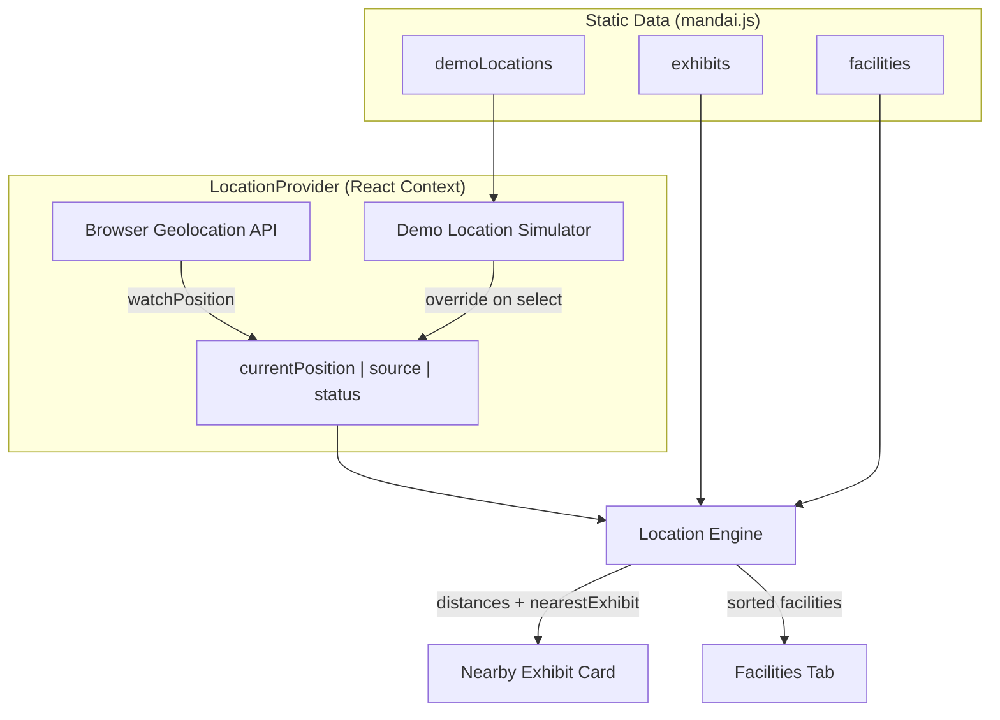
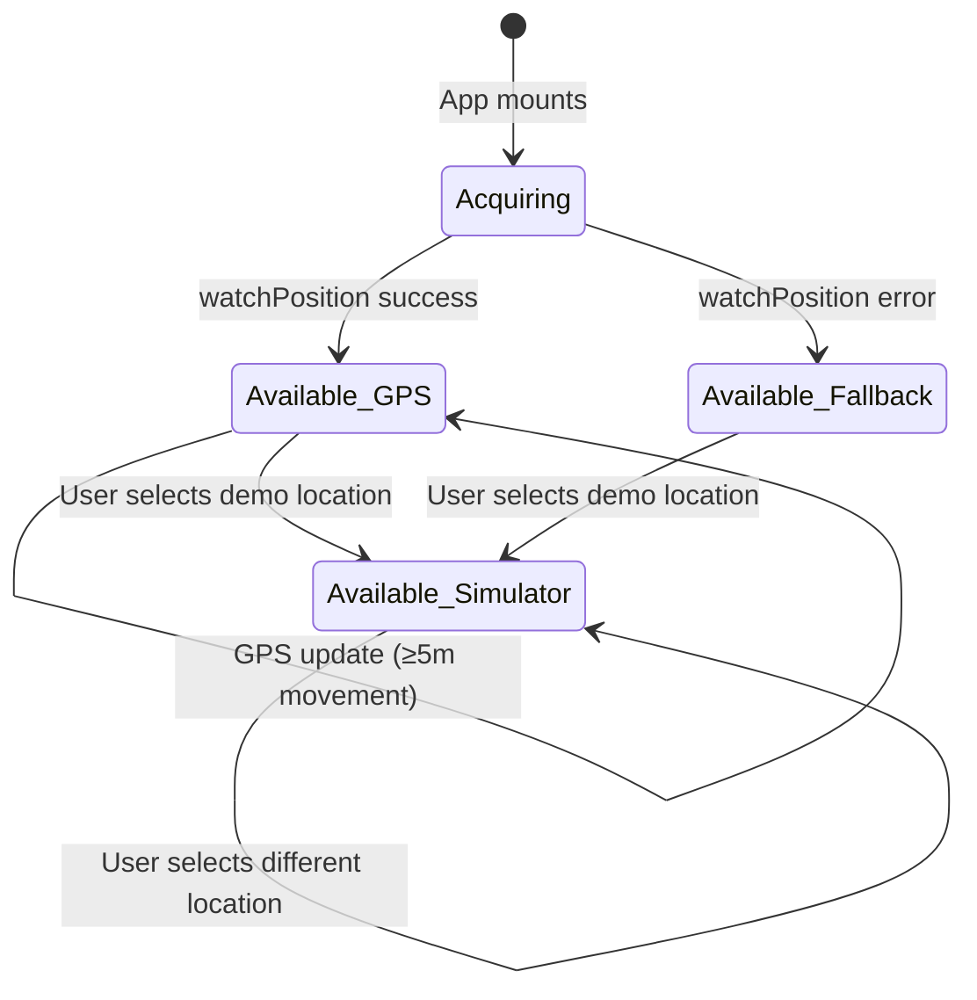

# Design Document: Location-Aware Exhibit Discovery

## Overview

This feature implements the core visitor interaction loop for the Mandai Wildlife Reserve web app. When a visitor's location changes (via real GPS or a demo simulator), the system computes distances to all exhibits, identifies the nearest one, and displays contextual information. The architecture is a client-side React application with a shared location state that drives three consumer views: a Nearby Exhibit Card, a Facilities Tab, and the Demo Location Simulator itself.

**Key design decisions:**
- **React + Context API** for state management — lightweight, sufficient for a single shared location concern, avoids external dependencies for a hackathon-scoped project.
- **Pure utility module** for Haversine computation — easily testable, decoupled from UI.
- **5-metre movement threshold** to avoid unnecessary recomputation on jittery GPS signals.
- **500-metre "reasonable radius"** beyond which no exhibit is considered nearby.

## Architecture



### Data Flow

1. **Initialization**: `LocationProvider` attempts `navigator.geolocation.watchPosition`. On success, coordinates flow into context state. On failure (denied/timeout), it falls back to the first `demoLocations` entry.
2. **Position Update**: When `currentPosition` changes by ≥5m from the last computed position, the Location Engine recalculates all distances.
3. **Consumer Rendering**: `NearbyExhibitCard` and `FacilitiesTab` subscribe to the context and re-render when the nearest exhibit or sorted facility list changes.
4. **Simulator Override**: Selecting a demo location writes directly to the context state, bypassing geolocation. This triggers the same recomputation pipeline.

## Components and Interfaces

### 1. `haversine(lat1, lng1, lat2, lng2) → number`

Pure function. Returns distance in metres between two coordinate pairs.

```typescript
// src/utils/haversine.ts
export function haversine(
  lat1: number, lng1: number,
  lat2: number, lng2: number
): number;
```

### 2. `LocationProvider` (React Context Provider)

Manages the single source of truth for the user's position and derived location data.

```typescript
// src/context/LocationContext.tsx

interface Position {
  lat: number;
  lng: number;
}

type PositionSource = 'gps' | 'simulator' | 'fallback';
type PositionStatus = 'acquiring' | 'available' | 'unavailable';

interface LocationState {
  currentPosition: Position | null;
  source: PositionSource;
  status: PositionStatus;
  nearestExhibit: ExhibitWithDistance | null;
  sortedFacilities: FacilityWithDistance[];
  allExhibitDistances: ExhibitWithDistance[];
}

interface LocationContextValue extends LocationState {
  setSimulatedPosition: (position: Position) => void;
  clearSimulatedPosition: () => void;
}
```

**Behavior:**
- On mount, calls `navigator.geolocation.watchPosition`.
- Stores the last position used for computation; skips recompute if new position is <5m away.
- On geolocation error/denial, sets source to `'fallback'` and uses `demoLocations[0]`.
- When `setSimulatedPosition` is called, sets source to `'simulator'` and stops using GPS values.

### 3. `LocationEngine` (computation module)

Not a React component — a module of pure functions consumed by the context provider.

```typescript
// src/engine/locationEngine.ts

interface ExhibitWithDistance {
  exhibit: Exhibit;
  distance: number; // metres
}

interface FacilityWithDistance {
  facility: Facility;
  distance: number; // metres
}

export function computeExhibitDistances(
  position: Position,
  exhibits: Exhibit[]
): ExhibitWithDistance[];

export function findNearestExhibit(
  exhibitsWithDistance: ExhibitWithDistance[],
  radiusMetres?: number // default 500
): ExhibitWithDistance | null;

export function computeFacilityDistances(
  position: Position,
  facilities: Facility[]
): FacilityWithDistance[];

export function hasMovedBeyondThreshold(
  prev: Position,
  current: Position,
  thresholdMetres?: number // default 5
): boolean;
```

### 4. `DemoLocationSimulator` (UI Component)

Sticky dropdown rendered at a fixed viewport position.

```typescript
// src/components/DemoLocationSimulator.tsx

interface DemoLocationSimulatorProps {
  // Consumes LocationContext internally
}
```

**Behavior:**
- Renders a `<select>` with a placeholder "Select a location" + all `demoLocations` entries.
- On change, calls `setSimulatedPosition({ lat, lng })` from context.
- Persists selection across view/tab navigation (context holds state).
- Styled with `position: sticky; top: 0; z-index: 1000`.

### 5. `NearbyExhibitCard` (UI Component)

Displays information about the nearest exhibit.

```typescript
// src/components/NearbyExhibitCard.tsx

interface NearbyExhibitCardProps {
  // Consumes LocationContext internally
}
```

**Renders:**
- Exhibit name
- IUCN Badge (color-coded span/tag)
- Fun fact text
- Feeding times (or placeholder if unavailable)
- Fallback "No exhibit nearby" state when `nearestExhibit` is null

### 6. `IUCNBadge` (UI Component)

Small presentational component for the conservation status indicator.

```typescript
// src/components/IUCNBadge.tsx

interface IUCNBadgeProps {
  status: 'Least Concern' | 'Vulnerable' | 'Endangered' | 'Critically Endangered';
}
```

**Color mapping:**
| Status | Color |
|--------|-------|
| Least Concern | Green (`#4caf50`) |
| Vulnerable | Yellow (`#ffeb3b`) |
| Endangered | Orange (`#ff9800`) |
| Critically Endangered | Red (`#f44336`) |

### 7. `FacilitiesTab` (UI Component)

Sorted list of facilities with distances.

```typescript
// src/components/FacilitiesTab.tsx

interface FacilitiesTabProps {
  // Consumes LocationContext internally
}
```

**Renders:**
- Each facility: name, type icon/label, distance (rounded to nearest whole metre), landmark-relative direction string (e.g., "45m toward Giant Panda Enclosure").
- If position is unavailable: message indicating location is required.

### 8. `FallbackNotification` (UI Component)

A dismissible banner/toast shown when geolocation falls back to the default demo location.

```typescript
// src/components/FallbackNotification.tsx

interface FallbackNotificationProps {
  visible: boolean;
  onDismiss: () => void;
}
```

## Data Models

### Exhibit (from `mandai.js`)

```typescript
interface Exhibit {
  id: string;
  name: string;
  lat: number;
  lng: number;
  iucnStatus: 'Least Concern' | 'Vulnerable' | 'Endangered' | 'Critically Endangered';
  funFact: string;
  feedingTimes: string[];
  diet: string;
  dietTags: string[];
  trophicRole: string;
  dependsOn: string[];
  predatorOf: string[];
  ecosystemImpactIfRemoved: string;
  imagenetLabels: string[];
  spriteBodyAsset: string;
  points: number;
}
```

### Facility (from `mandai.js`)

```typescript
interface Facility {
  id: string;
  type: 'restroom' | 'nursing' | 'accessible' | 'water-refill';
  name: string;
  lat: number;
  lng: number;
  nearestLandmark: string;
}
```

### DemoLocation (from `mandai.js`)

```typescript
interface DemoLocation {
  label: string;
  lat: number;
  lng: number;
}
```

### Derived Types

```typescript
interface Position {
  lat: number;  // -90 to 90
  lng: number;  // -180 to 180
}

interface ExhibitWithDistance {
  exhibit: Exhibit;
  distance: number; // metres, computed via Haversine
}

interface FacilityWithDistance {
  facility: Facility;
  distance: number; // metres, computed via Haversine
}
```


## Correctness Properties

*A property is a characteristic or behavior that should hold true across all valid executions of a system — essentially, a formal statement about what the system should do. Properties serve as the bridge between human-readable specifications and machine-verifiable correctness guarantees.*

### Property 1: Haversine distance completeness and non-negativity

*For any* valid position (lat in [-90, 90], lng in [-180, 180]) and *for any* non-empty array of exhibits, `computeExhibitDistances` SHALL return exactly one distance entry per exhibit, and every distance SHALL be ≥ 0.

**Validates: Requirements 1.1**

### Property 2: Nearest exhibit selection correctness

*For any* valid position and *for any* non-empty array of exhibits with computed distances, `findNearestExhibit` SHALL return the exhibit whose distance is the minimum among all exhibits within the radius threshold (default 500m). If two or more exhibits share the minimum distance, it SHALL return the one appearing first in the input array. If no exhibit is within the radius, it SHALL return null.

**Validates: Requirements 1.2, 3.4**

### Property 3: Movement threshold consistency

*For any* two valid positions `prev` and `current`, `hasMovedBeyondThreshold(prev, current, T)` SHALL return `true` if and only if `haversine(prev.lat, prev.lng, current.lat, current.lng) >= T`.

**Validates: Requirements 1.4**

### Property 4: Invalid coordinate rejection

*For any* position where latitude is outside [-90, 90] OR longitude is outside [-180, 180], the Location Engine SHALL return an "unavailable" status and SHALL NOT produce distance results.

**Validates: Requirements 1.5**

### Property 5: Facilities sorted by ascending distance

*For any* valid position and *for any* array of facilities, `computeFacilityDistances` SHALL return facilities sorted such that for every consecutive pair (facility[i], facility[i+1]), facility[i].distance ≤ facility[i+1].distance.

**Validates: Requirements 4.1**

### Property 6: Simulator position override exactness

*For any* demo location entry with coordinates (lat, lng), when that entry is selected in the Demo Location Simulator, the resulting `currentPosition` SHALL have lat and lng values exactly equal to the selected entry's lat and lng.

**Validates: Requirements 2.4**

### Property 7: Haversine symmetry

*For any* two valid positions A and B, `haversine(A.lat, A.lng, B.lat, B.lng)` SHALL equal `haversine(B.lat, B.lng, A.lat, A.lng)` (distance is symmetric).

**Validates: Requirements 1.1** (implicit correctness of the distance function)

## Error Handling

### Geolocation Errors

| Error Scenario | Handling |
|---|---|
| Permission denied (`GeolocationPositionError.PERMISSION_DENIED`) | Fall back to `demoLocations[0]`, show notification |
| Position unavailable (`GeolocationPositionError.POSITION_UNAVAILABLE`) | Fall back to `demoLocations[0]`, show notification |
| Timeout (`GeolocationPositionError.TIMEOUT`) | Fall back to `demoLocations[0]`, show notification |
| Geolocation API not supported | Fall back to `demoLocations[0]`, show notification |

All geolocation errors converge to the same fallback path (Requirement 5):
1. Set `currentPosition` to `{ lat: demoLocations[0].lat, lng: demoLocations[0].lng }`
2. Set `source` to `'fallback'`
3. Set the simulator dropdown to the first entry
4. Display `FallbackNotification` explaining the default location is being used

### Invalid Data Handling

| Scenario | Handling |
|---|---|
| Exhibit with missing `feedingTimes` | Display card with placeholder "Feeding times unavailable" |
| Exhibit with null/undefined coordinates | Skip exhibit in distance computation |
| Empty `exhibits` array | `nearestExhibit` = null, card shows fallback state |
| Empty `facilities` array | Facilities tab shows "No facilities available" |
| `demoLocations` array empty | Hide simulator, rely solely on GPS |

### State Transitions



## Testing Strategy

### Testing Framework

- **Unit & Property Tests**: Vitest + fast-check (property-based testing library for JavaScript/TypeScript)
- **Component Tests**: Vitest + React Testing Library
- **Configuration**: Each property test runs a minimum of 100 iterations

### Property-Based Tests

Each correctness property maps to a single property-based test using `fast-check`:

| Property | Test File | Generator Strategy |
|---|---|---|
| P1: Completeness & non-negativity | `haversine.property.test.ts` | `fc.float({min: -90, max: 90})` for lat, `fc.float({min: -180, max: 180})` for lng, `fc.array(exhibitArb, {minLength: 1})` |
| P2: Nearest selection correctness | `locationEngine.property.test.ts` | Random positions + random exhibit arrays with pre-computed distances |
| P3: Movement threshold | `locationEngine.property.test.ts` | Pairs of random valid positions + random threshold values |
| P4: Invalid coordinate rejection | `locationEngine.property.test.ts` | `fc.float()` unconstrained (will produce out-of-range values), filter for invalid |
| P5: Facilities sort order | `locationEngine.property.test.ts` | Random positions + random facility arrays |
| P6: Simulator position override | `DemoLocationSimulator.property.test.ts` | Random demoLocation entries |
| P7: Haversine symmetry | `haversine.property.test.ts` | Pairs of random valid positions |

**Tag format**: Each test is annotated with:
```
// Feature: location-aware-exhibit-discovery, Property N: <property text>
```

### Unit Tests (Example-Based)

| Requirement | Test Focus |
|---|---|
| 1.3 | Engine accepts decimal-degree format from both sources |
| 2.1 | Simulator renders with sticky positioning |
| 2.3, 2.5 | Selection triggers update within timing bounds |
| 2.6 | Initial state shows placeholder, uses GPS |
| 2.7 | Selection persists across navigation |
| 3.1 | Card renders name, IUCN badge, fun fact, feeding times |
| 3.2 | IUCN badge color mapping (4 cases) |
| 3.3 | Card updates when nearest exhibit changes |
| 3.5 | Missing feeding times shows placeholder |
| 4.2 | Facility entry shows name, type, rounded distance, landmark |
| 4.4 | Unavailable position shows fallback message |
| 5.1–5.4 | Geolocation failure triggers fallback with correct state |

### Integration Tests

| Scenario | Coverage |
|---|---|
| Full flow: select demo location → card updates → facilities re-sort | Requirements 2.3, 2.5, 3.3, 4.3 |
| Geolocation denied → fallback → simulator shows first entry → card displays | Requirements 5.1–5.4, 3.1 |
| GPS position change by >5m → recomputation → new nearest exhibit | Requirements 1.4, 3.3 |

### Test File Structure

```
src/
├── utils/
│   └── __tests__/
│       ├── haversine.test.ts           # unit tests
│       └── haversine.property.test.ts  # property tests (P1, P7)
├── engine/
│   └── __tests__/
│       ├── locationEngine.test.ts           # unit tests
│       └── locationEngine.property.test.ts  # property tests (P2, P3, P4, P5)
├── components/
│   └── __tests__/
│       ├── DemoLocationSimulator.test.ts           # unit tests
│       ├── DemoLocationSimulator.property.test.ts  # property test (P6)
│       ├── NearbyExhibitCard.test.ts               # unit tests
│       └── FacilitiesTab.test.ts                   # unit tests
└── context/
    └── __tests__/
        └── LocationContext.test.ts  # integration tests
```
