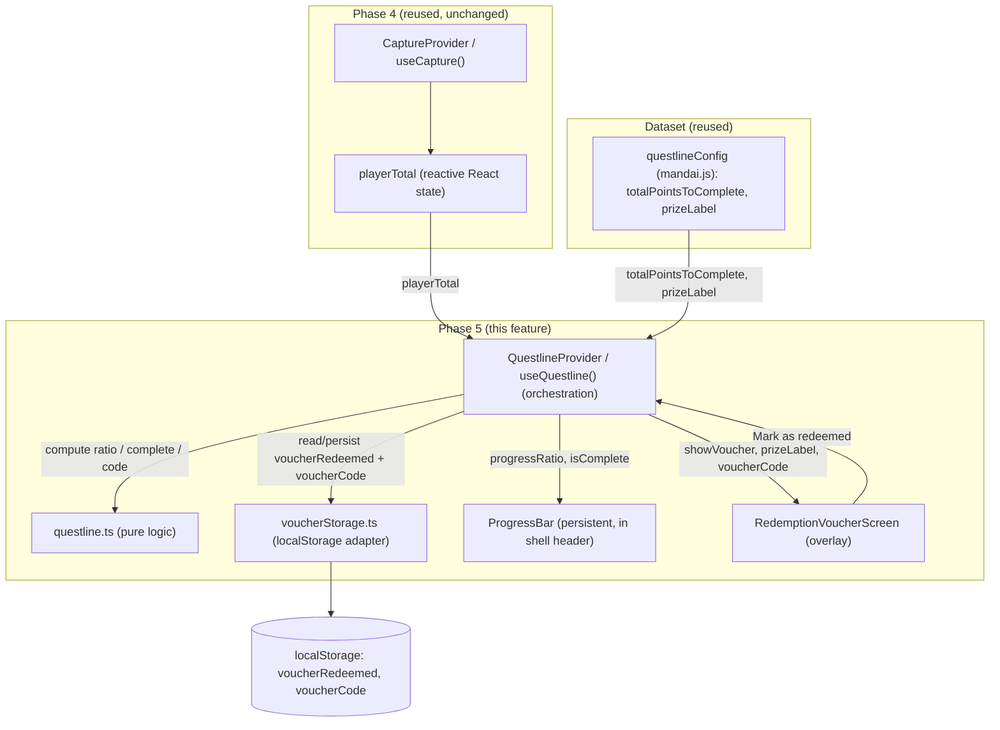
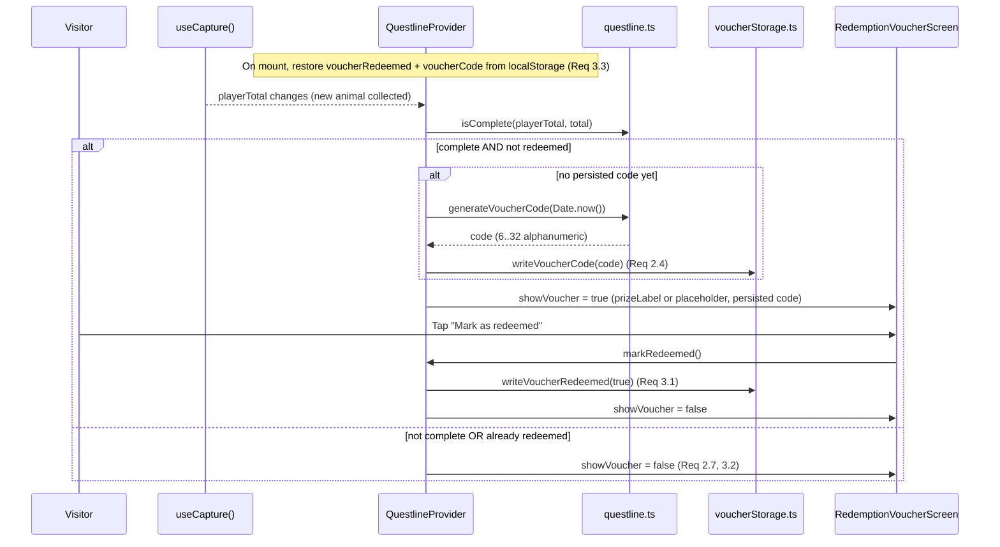

# Design Document: Questline Progress & Redemption

## Overview

This feature implements Phase 5 of the Mandai Wildlife Reserve visitor app. As a visitor collects animals across the reserve, a persistent Progress Bar shows their accumulated points against a fixed completion goal. When the accumulated points reach the goal, the app unlocks a Redemption Voucher Screen presenting the configured prize label plus a client-generated voucher code (no server validation). A "Mark as redeemed" action records the redeemed state in `localStorage` so the celebration does not repeat on later visits in the same browser.

This feature is a strict **consumer** of Phase 4 (checkpoint-photo-capture). It **reuses** `useCapture()` (`src/context/CaptureContext.tsx`) for the reactive `playerTotal`, and it reads `questlineConfig` (`{ totalPointsToComplete, prizeLabel }`) from the exhibits dataset (`src/data/mandai.js`). It does not reimplement points accounting, collection parsing, or any location logic.

**Key design decisions:**

- **Separate the pure logic from the effectful shell.** Progress ratio, completion test, and voucher-code generation are pure, deterministic functions in `src/engine/questline.ts` (fully property-testable). `localStorage` access lives behind a thin adapter (`src/engine/voucherStorage.ts`) modeled on the existing `storage.ts` — both reads and writes never throw.
- **`playerTotal` is consumed, never recomputed.** The reactive `playerTotal` from `useCapture()` already dedups points across distinct exhibits (Phase 4). This feature treats it as the single source of truth for progress and completion, so the Progress Bar updates without a page reload (Req 1.2).
- **Completion is derived; redeemed and code are persisted.** `Questline_Complete` is derived on every render from `playerTotal >= totalPointsToComplete`. Only two pieces of state are persisted: the `voucherRedeemed` flag and the `voucherCode`. The code is generated exactly once on first completion and then reused verbatim across renders and reloads (Req 2.4, 2.5).
- **The voucher never dead-ends a demo.** A missing/empty `prizeLabel` still shows the voucher with a placeholder label and never blocks code display (Req 2.2). A `localStorage` failure degrades gracefully: reads normalize to "not redeemed / no code" and writes report success/failure without throwing (Req 3.4).
- **No new dependencies.** React 18, Vitest, fast-check, and React Testing Library are already present. **Tailwind is not installed** — this feature uses inline styles / plain CSS, consistent with the rest of the app.

## Architecture



### Completion & voucher lifecycle



### Layering

1. **Pure core (no I/O, deterministic):** `questline.ts` — `computeProgressRatio`, `isComplete`, `generateVoucherCode`, `resolvePrizeLabel`. All correctness properties target this layer.
2. **Effectful adapter:** `voucherStorage.ts` — `localStorage` reads/writes for `voucherRedeemed` and `voucherCode`; never throws. Mocked in tests.
3. **UI + orchestration:** `QuestlineProvider`/`useQuestline`, `ProgressBar`, `RedemptionVoucherScreen`, and the App shell wiring.

## Components and Interfaces

### 1. `questline.ts` — questline logic (pure)

No React, no `localStorage`. Deterministic functions over plain values.

```typescript
// src/engine/questline.ts

/** Placeholder shown when the configured prize label is absent/empty (Req 2.2). */
export const PLACEHOLDER_PRIZE_LABEL = 'Prize unavailable';

/** Voucher code length bounds (Req 2.4): 6..32 alphanumeric characters. */
export const VOUCHER_CODE_MIN_LENGTH = 6;
export const VOUCHER_CODE_MAX_LENGTH = 32;

/**
 * Progress as a percentage in [0, 100].
 *  - ratio = (playerTotal / total) * 100, clamped to [0, 100] (Req 1.3, 1.4).
 *  - When `total` is <= 0 or not finite, returns 100 if playerTotal > 0 else 0
 *    (avoids divide-by-zero; a non-positive goal is treated as trivially met).
 *  - Negative playerTotal clamps to 0.
 */
export function computeProgressRatio(playerTotal: number, total: number): number;

/**
 * Whether the questline is complete: playerTotal >= total (Req 2.1, 2.6).
 * A non-positive/non-finite `total` is treated as already complete when
 * playerTotal is a finite number >= 0.
 */
export function isComplete(playerTotal: number, total: number): boolean;

/**
 * Resolve the label to display: the configured label when it is a non-empty
 * (non-whitespace) string, otherwise PLACEHOLDER_PRIZE_LABEL (Req 2.2, 2.3).
 */
export function resolvePrizeLabel(prizeLabel: string | undefined | null): string;

/**
 * Generate a voucher code derived deterministically from `timestamp`.
 *  - Output is 6..32 characters (Req 2.4).
 *  - Contains only alphanumeric characters [A-Z0-9] (Req 2.4).
 *  - Deterministic: same timestamp -> same code (supports persistence/reuse).
 *  - No external service is contacted (pure function).
 * Implementation: base-36 encode the timestamp, upper-case it, and pad to the
 * minimum length so short timestamps still satisfy the length bound.
 */
export function generateVoucherCode(timestamp: number): string;
```

### 2. `voucherStorage.ts` — persistence adapter (effectful)

Thin wrapper over `localStorage` for the two persisted keys, mirroring `storage.ts`: reads normalize any failure to a safe default and writes report a boolean without throwing (Req 3.1, 3.3, 3.4).

```typescript
// src/engine/voucherStorage.ts

export const VOUCHER_REDEEMED_KEY = 'voucherRedeemed';
export const VOUCHER_CODE_KEY = 'voucherCode';

/**
 * Read the redeemed flag. Returns true only when the stored value parses to
 * the boolean true; absent/unparseable/any-error -> false (Req 3.4). Never throws.
 */
export function readVoucherRedeemed(): boolean;

/** Persist the redeemed flag. Returns false on any error (Req 3.1). Never throws. */
export function writeVoucherRedeemed(redeemed: boolean): boolean;

/**
 * Read the persisted voucher code, or null when absent/empty/any-error (Req 2.5).
 * Never throws.
 */
export function readVoucherCode(): string | null;

/** Persist the voucher code. Returns false on any error (Req 2.4). Never throws. */
export function writeVoucherCode(code: string): boolean;
```

The redeemed flag is stored as the JSON string `"true"` / `"false"`; `readVoucherRedeemed` parses defensively and treats anything other than boolean `true` as not redeemed (Req 3.4). The code is stored as a raw string.

### 3. `QuestlineProvider` / `useQuestline()` — orchestration (React context + hook)

Owns the questline decisioning: reads `playerTotal` from `useCapture()`, reads/persists `voucherRedeemed` + `voucherCode`, derives progress and completion via `questline.ts`, generates+persists the code once on first completion, and decides when the voucher should auto-show.

```typescript
// src/context/QuestlineContext.tsx
import type { ReactNode } from 'react';

export interface QuestlineContextValue {
  /** Reactive accumulated points from useCapture() (Req 1.1, 1.2). */
  playerTotal: number;
  /** Sourced from questlineConfig.totalPointsToComplete (Req 1.5). */
  totalPointsToComplete: number;
  /** Clamped [0,100] percentage for the Progress Bar (Req 1.3, 1.4). */
  progressRatio: number;
  /** playerTotal >= totalPointsToComplete (Req 2.1, 2.6). */
  isComplete: boolean;
  /** True when complete AND not redeemed: the voucher should be shown (Req 2.1, 2.7, 3.2). */
  showVoucher: boolean;
  /** Resolved label (configured or placeholder) (Req 2.2, 2.3). */
  prizeLabel: string;
  /** The persisted voucher code, present once complete (Req 2.4, 2.5). */
  voucherCode: string | null;
  /** Whether the voucher has been marked redeemed (Req 3.x). */
  redeemed: boolean;
  /** Set the redeemed flag true, persist it, and hide the voucher (Req 3.1, 3.2). */
  markRedeemed: () => void;
}

export function QuestlineProvider(props: {
  /** Injectable for tests; defaults to questlineConfig from mandai.js. */
  config?: { totalPointsToComplete: number; prizeLabel: string };
  children: ReactNode;
}): JSX.Element;

export function useQuestline(): QuestlineContextValue;
```

Orchestration behavior:

1. **On mount**, restore `redeemed` from `readVoucherRedeemed()` and `voucherCode` from `readVoucherCode()` (Req 3.3, 2.5).
2. **On every render**, read `playerTotal` from `useCapture()`; derive `progressRatio = computeProgressRatio(playerTotal, total)` and `isComplete = isComplete(playerTotal, total)`.
3. **Code generation (once):** in an effect, when `isComplete && !redeemed && voucherCode === null`, call `generateVoucherCode(Date.now())`, set it in state, and `writeVoucherCode(code)` (Req 2.4). If a code already exists (state or storage), it is reused unchanged (Req 2.5).
4. **`showVoucher = isComplete && !redeemed`** (Req 2.1, 2.6, 2.7, 3.2).
5. **`markRedeemed()`** sets `redeemed = true`, calls `writeVoucherRedeemed(true)`, which flips `showVoucher` to false (Req 3.1, 3.2).

Auto-show latency (Req 2.1, within 1s): because `playerTotal` is React state, the completion check runs in the same commit as the total's update, so the voucher appears on the next render — well within budget with no polling.

### 4. `ProgressBar` — persistent progress indicator (UI)

Rendered in the App shell **above the tabs**, so it is always visible regardless of the active tab (Req 1.1). Consumes `useQuestline()`.

```typescript
// src/components/ProgressBar.tsx
export function ProgressBar(): JSX.Element;
// Renders: a labeled bar whose fill width is `${progressRatio}%`,
// plus text "playerTotal / totalPointsToComplete".
// Uses inline styles (Tailwind is NOT installed).
// Accessibility: role="progressbar", aria-valuemin=0, aria-valuemax=100,
// aria-valuenow={Math.round(progressRatio)}.
```

### 5. `RedemptionVoucherScreen` — completion overlay (UI)

A fixed overlay shown when `useQuestline().showVoucher` is true (rendered conditionally by the App shell). Presents the resolved `prizeLabel`, the `voucherCode`, and a "Mark as redeemed" button.

```typescript
// src/components/RedemptionVoucherScreen.tsx
export interface RedemptionVoucherScreenProps {
  prizeLabel: string;      // already resolved (may be the placeholder)
  voucherCode: string;     // persisted code
  onMarkRedeemed: () => void;
}
export function RedemptionVoucherScreen(props: RedemptionVoucherScreenProps): JSX.Element;
// role="dialog", aria-modal, labeled heading; inline styles.
// The voucher code region is always rendered even when prizeLabel is the
// placeholder (Req 2.2).
```

### 6. App shell integration

`App.tsx` wraps the existing shell in `QuestlineProvider` (inside `CaptureProvider`, since it consumes `useCapture()`), renders `<ProgressBar />` persistently above the tab navigation, and conditionally renders `<RedemptionVoucherScreen />` as an overlay when `showVoucher` is true.

```
<LocationProvider>
  <CaptureProvider>
    <QuestlineProvider>
      <AppShell />   // ProgressBar (persistent) + tabs + voucher overlay
    </QuestlineProvider>
  </CaptureProvider>
</LocationProvider>
```

The voucher overlay wiring in the shell:

```
const { showVoucher, prizeLabel, voucherCode, markRedeemed } = useQuestline();
...
{showVoucher && voucherCode !== null && (
  <RedemptionVoucherScreen
    prizeLabel={prizeLabel}
    voucherCode={voucherCode}
    onMarkRedeemed={markRedeemed}
  />
)}
```

## Data Models

### QuestlineConfig (reused)

Already defined in `src/types/index.ts` and sourced from `questlineConfig` in `mandai.js`:

```typescript
export interface QuestlineConfig {
  totalPointsToComplete: number; // default 100
  prizeLabel: string;            // default "Free scoop at Ah Meng Restaurant"
}
```

### Voucher state (in-memory, derived + persisted)

```typescript
// Conceptual shape held by QuestlineProvider (not a single persisted object).
interface VoucherState {
  redeemed: boolean;        // persisted under 'voucherRedeemed'
  voucherCode: string | null; // persisted under 'voucherCode'
}
```

### Persistence shape

| localStorage key | Value | Read default on absent/error |
|---|---|---|
| `voucherRedeemed` | JSON boolean string (`"true"` / `"false"`) | `false` (not redeemed) — Req 3.4 |
| `voucherCode` | raw alphanumeric string (6..32 chars) | `null` (no code yet) — Req 2.5 |

`playerTotal`, `progressRatio`, `isComplete`, and `showVoucher` are **derived** each render and never persisted. `progressRatio` is the clamped percentage; `Questline_Complete` is `playerTotal >= totalPointsToComplete`.

## Correctness Properties

*A property is a characteristic or behavior that should hold true across all valid executions of a system — essentially, a formal statement about what the system should do. Properties serve as the bridge between human-readable specifications and machine-verifiable correctness guarantees.*

The properties below target the pure logic in `questline.ts`, where behavior varies richly with numeric and string inputs. UI persistence, reactivity, restore-on-mount, the redeemed gating, the 1-second display budget, and `localStorage` failure handling are covered by example, integration, and edge-case tests in the Testing Strategy rather than by properties.

**Property reflection.** The prework surfaced six testable-as-property criteria that consolidate into four non-redundant properties: 1.3 (in-range ratio value) and 1.4 (clamp at/above the goal plus the universal `[0,100]` bound) describe one function, `computeProgressRatio`, so they merge into Property 1. Likewise 2.6 (`>=` treats equal and greater as complete) and 2.7 (`<` is not complete) are the two halves of a single equivalence `isComplete == (playerTotal >= total)`, merged into Property 2. Criterion 2.4's three facets (length bounds, alphanumeric-only, timestamp determinism) are distinct guarantees of one function and merge into Property 4. Criterion 2.2 stands alone as Property 3.

### Property 1: Progress ratio is the clamped percentage in [0, 100]

*For any* finite `playerTotal >= 0` and *for any* finite `total > 0`, `computeProgressRatio(playerTotal, total)` SHALL satisfy all of: (a) the result is always within `[0, 100]`; (b) WHEN `0 <= playerTotal <= total`, the result equals `(playerTotal / total) * 100` (within floating-point tolerance); and (c) WHEN `playerTotal >= total`, the result equals exactly `100`.

**Validates: Requirements 1.3, 1.4**

### Property 2: Completion holds exactly when the total meets or exceeds the goal

*For any* finite `playerTotal` and *for any* finite `total`, `isComplete(playerTotal, total)` SHALL equal `playerTotal >= total`. Consequently, it is `true` for every `playerTotal >= total` (equal or greater) and `false` for every `playerTotal < total`.

**Validates: Requirements 2.1, 2.6, 2.7**

### Property 3: Prize label resolves to the configured label or the placeholder

*For any* string input, `resolvePrizeLabel` SHALL return `PLACEHOLDER_PRIZE_LABEL` when the input is `null`, `undefined`, empty, or composed entirely of whitespace, and SHALL return the input unchanged for every string that contains at least one non-whitespace character.

**Validates: Requirements 2.2**

### Property 4: Voucher codes are alphanumeric, length-bounded, and deterministic from the timestamp

*For any* timestamp value (including `0`, negatives, and very large numbers), `generateVoucherCode(timestamp)` SHALL produce a string whose length is within `[VOUCHER_CODE_MIN_LENGTH, VOUCHER_CODE_MAX_LENGTH]` (6..32), that matches `^[A-Z0-9]+$` (alphanumeric only), and that is deterministic: `generateVoucherCode(t) === generateVoucherCode(t)` for the same `t`.

**Validates: Requirements 2.4**

## Error Handling

### Persistence failures (normalized, never a dead-end)

| Scenario | Handling |
|---|---|
| `localStorage['voucherRedeemed']` absent | `readVoucherRedeemed` → `false`; redeemed state treated as not redeemed (Req 3.4) |
| `voucherRedeemed` value is not the boolean `true` (e.g. `"1"`, `"yes"`, garbage) | Interpreted as `false` (Req 3.4) |
| `localStorage.getItem` throws (private mode / unavailable) | Read normalizes to safe default (`false` / `null`); never throws (Req 3.3, 3.4) |
| `localStorage['voucherCode']` absent/empty | `readVoucherCode` → `null`; provider generates a code on first completion (Req 2.4, 2.5) |
| `writeVoucherRedeemed` / `writeVoucherCode` throws (quota / unavailable) | Returns `false`; in-memory state is kept so the current session still behaves correctly. On the redeemed path, the voucher is still hidden for this session even if the flag failed to persist (Req 3.1); on the code path, the in-memory code is still displayed even if persistence failed (Req 2.4) |

### Configuration edge cases

| Scenario | Handling |
|---|---|
| `prizeLabel` absent, empty, or whitespace-only | `resolvePrizeLabel` returns `PLACEHOLDER_PRIZE_LABEL`; the voucher and its code are still shown (Req 2.2) |
| `totalPointsToComplete` is `0` or non-positive | `computeProgressRatio` avoids divide-by-zero (returns 100 when `playerTotal > 0`, else 0); `isComplete` treats a non-positive goal as met for finite `playerTotal >= 0`. The questline is trivially complete — acceptable for a demo config that always defaults to 100 |
| `playerTotal` exceeds `totalPointsToComplete` | Ratio clamps to 100 (Req 1.4); questline stays complete and the voucher shows under the same conditions as equality (Req 2.6) |
| `playerTotal` negative (should not occur from Phase 4) | Ratio clamps to 0; `isComplete` is `false` for a negative total below the goal |

### Voucher code stability

- The code is generated **once** on first completion and persisted; on every subsequent render/reload the provider reuses the persisted code rather than regenerating, so the displayed code never changes for a given completion (Req 2.5). Because `generateVoucherCode` is deterministic from its input timestamp, even a regeneration from the same captured timestamp would yield the same code — defense in depth against accidental churn.

## Testing Strategy

### Frameworks

- **Unit & property tests:** Vitest + `fast-check` (already in `devDependencies`). Each property test runs a minimum of **100 iterations**.
- **Component & hook tests:** Vitest + React Testing Library + `@testing-library/jest-dom` (already present).
- **Mocks:** `localStorage` is stubbed/spied per test; `useCapture()` is mocked (or a test `CaptureProvider` supplies a controlled `playerTotal`) so the questline logic is exercised independently of Phase 4; `Date.now()` is stubbed where the generated code must be asserted.

### Why property-based testing applies here

`questline.ts` is a set of pure functions over large input spaces: arbitrary numeric pairs for the progress ratio and completion test, arbitrary strings (including whitespace) for label resolution, and arbitrary timestamps for code generation. Each has clear universal invariants (clamping/`[0,100]` bounds, the `>=` equivalence, placeholder-vs-passthrough, and alphanumeric/length/determinism), so PBT is the right tool. Persistence effects, React reactivity, restore-on-mount, redeemed gating, and the 1-second display budget do **not** vary meaningfully with input and are covered by integration/example/edge-case tests instead.

### Property test mapping

| Property | Module | Test file | Generator strategy |
|---|---|---|---|
| P1 Progress ratio clamp/value | `questline.ts` | `questline.property.test.ts` | Random finite `playerTotal >= 0`, `total > 0`; assert `[0,100]` bound, in-range value equality (tolerance), and `== 100` when `playerTotal >= total` |
| P2 Completion threshold | `questline.ts` | `questline.property.test.ts` | Random finite `playerTotal`, `total`; assert `isComplete == (playerTotal >= total)` |
| P3 Prize label resolution | `questline.ts` | `questline.property.test.ts` | Mix of empty/whitespace strings, `null`/`undefined`, and non-whitespace strings; assert placeholder vs passthrough |
| P4 Voucher code format/determinism | `questline.ts` | `questline.property.test.ts` | Random integers incl. `0`, negatives, large values; assert length `[6,32]`, `/^[A-Z0-9]+$/`, and `gen(t)===gen(t)` |

**Tag format** — each property test is annotated:
```
// Feature: questline-progress, Property N: <property text>
```

Each correctness property is implemented by a **single** property-based test configured for at least 100 iterations.

### Unit / example tests

| Requirement | Focus |
|---|---|
| 1.1 | `ProgressBar` renders persistently in the shell and remains present across tab switches |
| 1.2 | Updating the mocked `playerTotal` updates the bar fill/text without a remount |
| 2.3 | `RedemptionVoucherScreen` renders the provided `prizeLabel` |
| 2.2 | Voucher renders the code region even when `prizeLabel` is the placeholder |
| 3.4 | `readVoucherRedeemed` returns `false` for representative malformed raw values (`"1"`, `"yes"`, `""`, non-JSON); optional small property over arbitrary strings `!= "true"` mapping to `false` |

### Integration tests (`QuestlineProvider` / `useQuestline`)

| Scenario | Coverage |
|---|---|
| `totalPointsToComplete` from injected config flows into progress + completion | Req 1.5 |
| Below threshold → `showVoucher` is `false`, no voucher overlay | Req 2.7 |
| Reaches/exceeds threshold and not redeemed → `showVoucher` becomes `true`, code generated + persisted | Req 2.1, 2.4 |
| Seeded persisted `voucherCode` → reused unchanged across re-renders/remounts (not regenerated) | Req 2.5 |
| `markRedeemed()` → `localStorage['voucherRedeemed']` set to `true`, `showVoucher` flips to `false` | Req 3.1, 3.2 |
| Seed `voucherRedeemed=true` + complete state → voucher suppressed on mount | Req 3.2, 3.3 |
| `localStorage` throws on read/write → provider still renders; redeemed defaults to `false`, code held in memory | Req 2.4, 3.3, 3.4 |

### Performance notes

- **1-second auto-show (Req 2.1):** `playerTotal` is React state, so the completion check runs in the same commit as the total's update; the voucher renders on the next React commit with no polling. Verified via an integration test that updates the total and asserts the overlay appears synchronously, rather than a wall-clock assertion.
- **Code generation runs once** (guarded by `isComplete && !redeemed && voucherCode === null`), so there is no per-render work on the completion path beyond a cheap comparison.
