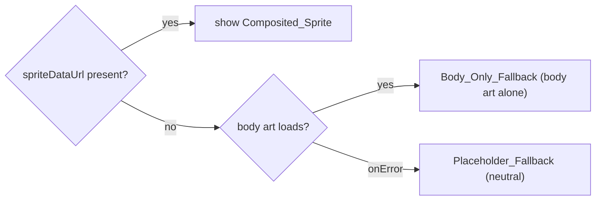

# Design Document: Sprite Generation

## Overview

This feature implements Phase 6 of the Mandai Wildlife Reserve visitor app. Each animal a visitor collected during Phase 4 (checkpoint-photo-capture) is turned into a personalized **sprite**: the visitor's captured photo, cropped into a circular head, composited onto pre-made placeholder body art for that exhibit. Compositing happens in the browser with the Canvas API. The result is stored back onto the `Collected_Record` as a new `spriteDataUrl` field so it survives refreshes, and shown in a "My Collected Animals" gallery that visually confirms compositing works.

This feature is a strict **consumer and extender** of Phase 4 (checkpoint-photo-capture). It reuses `CaptureProvider` / `useCapture()` for the persisted `collection`, reuses the `storage.ts` adapter (`localStorage` key `collectedAnimals`), and reuses each exhibit's `spriteBodyAsset` from `mandai.js`. It does not reimplement capture, classification, or points logic. It only **adds** a `spriteDataUrl` field to `CollectedRecord` and a mechanism to fill and persist it.

**Key design decisions:**

- **Separate the pure math from the effectful canvas shell.** The head-position math (fractional → pixel conversion) and the centered-square crop-region computation are pure, deterministic functions and are fully property-testable. The actual image loading, canvas drawing, and `toDataURL` export are an effectful adapter (`spriteCompositor.ts`) that is exercised by example/integration tests with mocked `Image`/`Canvas`.
- **Generation never throws — it returns `null`.** Every failure mode (corrupted photo, zero-dimension photo, body asset load timeout, missing `getContext`, `toDataURL` error) is normalized to a `null` return so the orchestration layer can route to the fallback tiers without special-casing exceptions (Req 2.2, 2.6, 4.2).
- **Fallback is a display concern with three tiers.** When there is no `spriteDataUrl`, the UI shows the body art alone (`Body_Only_Fallback`); if the body art also fails to load, it shows a neutral `Placeholder_Fallback`. A broken `` is never shown (Req 4.2, 4.3, 5.3).
- **Generation is lazy, idempotent, independent, and bounded.** On load, records lacking a `spriteDataUrl` are generated one at a time, asynchronously, so the gallery stays responsive (Req 6.1). Each record is generated independently so one failure does not block others (Req 6.2). A record that already has a `spriteDataUrl` is never regenerated (Req 3.2). A permanently-failing record is retried only up to a bounded number of in-memory attempts so generation cannot loop forever (Req 4.4).
- **Deterministic Head_Position.** Head_Position is a fixed `{cx, cy, diameter}` expressed as fractions of the body dimensions, so identical inputs produce a byte-identical `spriteDataUrl` (Req 2.5).
- **Placeholder body art must be created.** The `spriteBodyAsset` PNGs referenced by `mandai.js` do not exist yet. This feature adds simple solid-color silhouette PNGs under `public/sprites/bodies/`, one per exhibit id, so compositing has real assets to load.
- **No new runtime dependencies.** Canvas is a browser API; React 18, Vitest, fast-check, and React Testing Library are already present. Tailwind is **not** installed, so all styling uses inline styles per the project convention.

## Architecture

```mermaid
graph TD
    subgraph Phase4 ["Phase 4 (reused / extended)"]
        CC["CaptureProvider / useCapture()"]
        STORE[("localStorage:collectedAnimals")]
        STG["storage.ts (readRaw/write)"]
        DATA["exhibits (mandai.js) — spriteBodyAsset"]
    end

    subgraph Phase6 ["Phase 6 (this feature)"]
        HSG["useSpriteGeneration() (orchestration hook)"]
        SC["spriteCompositor.ts (Canvas adapter)"]
        SG["spriteGeometry.ts (pure head/crop math)"]
        GV["GalleryView (My Collected Animals)"]
        SI["SpriteImage (fallback chain)"]
        BODIES[("public/sprites/bodies/*.png")]
    end

    CC -->|collection: CollectedRecord[]| HSG
    HSG -->|record.photo + bodyAssetUrl + headPos| SC
    SC --> SG
    SC -->|loads photo + body| BODIES
    SC -->|spriteDataUrl or null| HSG
    HSG -->|updateSpriteDataUrl id, url| CC
    CC --> STG --> STORE
    DATA -->|spriteBodyAsset| HSG
    CC -->|collection| GV
    GV --> SI
    SI --> BODIES
```

### Generation sequence (per record, lazy)

```mermaid
sequenceDiagram
    participant GV as GalleryView
    participant H as useSpriteGeneration
    participant CC as CaptureProvider
    participant C as spriteCompositor
    participant G as spriteGeometry

    GV->>H: mount (collection available)
    H->>H: find records with no spriteDataUrl and attempts < MAX
    loop each missing record (async, one at a time)
        H->>H: resolve exhibit by exhibitId
        alt exhibitId unknown
            H->>H: skip (leave spriteDataUrl absent, no retry)
        else exhibit known
            H->>H: record attempt (in-memory attempts++)
            H->>C: generateSprite(photo, exhibit.spriteBodyAsset, HEAD_POSITION)
            C->>C: load photo + body via Image (5s timeout)
            C->>G: cropRegion(w,h) ; headRect(bodyW,bodyH,HEAD_POSITION)
            C-->>H: spriteDataUrl OR null
            alt spriteDataUrl produced
                H->>CC: updateSpriteDataUrl(exhibitKey, dataUrl)
                CC->>CC: persist to localStorage (keep in memory if write fails)
                CC-->>GV: collection updated -> re-render sprite
            else null (Compositing_Failure)
                H->>H: leave spriteDataUrl absent; will retry if attempts < MAX
            end
        end
    end
```

### Display fallback chain (per record)



### Layering

1. **Pure core (no I/O, deterministic):** `spriteGeometry.ts` — crop-region and head-rectangle math. All correctness properties target this layer.
2. **Effectful adapter:** `spriteCompositor.ts` — image loading (with timeout), canvas drawing, `toDataURL`. Never throws; returns `string | null`. Mocked in tests.
3. **Orchestration:** `useSpriteGeneration()` — finds missing sprites, drives generation independently and non-blocking, tracks bounded attempts, and calls back into the capture context to persist.
4. **UI:** `SpriteImage` (fallback chain) and `GalleryView` (My Collected Animals). Inline styles only.
5. **Assets:** `public/sprites/bodies/*.png` placeholder body art.

## Components and Interfaces

### 1. `spriteGeometry.ts` — head/crop math (pure)

Pure, deterministic geometry shared by the compositor and by tests. No canvas, no I/O.

```typescript
// src/engine/spriteGeometry.ts

/**
 * Head_Position expressed as fractions of the Sprite_Body_Asset dimensions.
 * cx/cy are the head-circle center as a fraction of body width/height;
 * diameter is the head-circle diameter as a fraction of body width.
 * A single fixed instance is used for every generation (Req 2.5).
 */
export interface HeadPosition {
  cx: number;       // 0..1 (fraction of body width)
  cy: number;       // 0..1 (fraction of body height)
  diameter: number; // 0..1 (fraction of body width)
}

/** The one fixed Head_Position used for all sprites (Req 2.5). */
export const HEAD_POSITION: HeadPosition;

/** A rectangle in device pixels. */
export interface Rect {
  x: number;
  y: number;
  width: number;
  height: number;
}

/**
 * The centered square source region of the photo used for the circular head:
 * side = min(width, height), centered, so the crop never leaves the photo
 * bounds (Req 2.1). For a zero-dimension photo the side is 0.
 */
export function cropRegion(photoWidth: number, photoHeight: number): Rect;

/**
 * The destination rectangle (in body pixels) where the circular head is drawn,
 * derived from HEAD_POSITION and the body dimensions. The circle of the given
 * diameter is centered at (cx*bodyWidth, cy*bodyHeight); the returned Rect is
 * the bounding box of that circle (Req 2.3, 2.5).
 */
export function headRect(
  bodyWidth: number,
  bodyHeight: number,
  head?: HeadPosition, // defaults to HEAD_POSITION
): Rect;
```

### 2. `spriteCompositor.ts` — Canvas adapter (effectful)

Loads the photo and body art, crops the photo to a circle, composites, and exports. Never throws; returns `null` on any failure so the caller routes to fallback (Req 2.2, 2.6, 4.2).

```typescript
// src/engine/spriteCompositor.ts
import type { HeadPosition } from './spriteGeometry';

/** Max time to wait for either image to load before aborting (Req 2.6, 4.3). */
export const IMAGE_LOAD_TIMEOUT_MS = 5000;

/**
 * Produce a Composited_Sprite as a data URL, or null on any Compositing_Failure.
 *
 * Steps:
 *  1. Load the photo and body art via Image, each bounded by
 *     IMAGE_LOAD_TIMEOUT_MS. A timeout or load error -> null (Req 2.6).
 *  2. If the photo has zero width or height -> null (Req 2.2).
 *  3. Compute the centered-square cropRegion of the photo (Req 2.1).
 *  4. Draw the body onto a canvas sized to the body, then clip to the head
 *     circle and draw the cropped photo at headRect (body first, head over
 *     it) (Req 2.3).
 *  5. Export via canvas.toDataURL('image/png') (Req 2.4).
 *
 * Returns the data URL, or null if getContext is unavailable, drawing throws,
 * or toDataURL throws/returns empty. Never rejects.
 *
 * @param photoDataUrl  the Collected_Record's existing `photo` data URL
 * @param bodyAssetUrl  the exhibit's `spriteBodyAsset` path
 * @param headPosition  fractional Head_Position (defaults to HEAD_POSITION)
 */
export function generateSprite(
  photoDataUrl: string,
  bodyAssetUrl: string,
  headPosition?: HeadPosition,
): Promise<string | null>;
```

Notes:
- Image loading uses a small internal `loadImage(url, timeoutMs)` helper that resolves to `HTMLImageElement | null` (never rejects); it clears its timer on load/error and resolves `null` when the timer fires first.
- The head circle is produced by `ctx.save()` → `ctx.beginPath()` → `ctx.arc(...)` → `ctx.clip()` → `drawImage(photo, srcCrop, headRect)` → `ctx.restore()`, using the pure `cropRegion` (source) and `headRect` (destination).
- Because canvas state and Head_Position are fixed, identical `(photoDataUrl, bodyAssetUrl)` inputs yield a byte-identical export (Req 2.5).

### 3. `useSpriteGeneration()` — orchestration hook

Drives lazy, independent, non-blocking, bounded generation over the current collection. Consumes `useCapture()` for the `collection` and an updater, resolves each record's exhibit, and calls `generateSprite`.

```typescript
// src/hooks/useSpriteGeneration.ts
import type { CollectedRecord } from '../types';

/** Max in-memory generation attempts per record before giving up (Req 4.4). */
export const MAX_SPRITE_ATTEMPTS = 3;

/**
 * On mount and whenever the collection changes, finds records that lack a
 * spriteDataUrl and whose in-memory attempt count is below MAX_SPRITE_ATTEMPTS,
 * and generates their sprites one at a time (async, so the UI stays
 * responsive — Req 6.1). Each record is processed independently so one
 * failure does not block the others (Req 6.2). Records whose exhibitId is
 * unknown are skipped and not retried (Req 1.3). A successful generation is
 * pushed back via the capture context's updater, which updates the gallery
 * entry and persists (Req 3.1, 6.3).
 *
 * Idempotent: a record that already has a spriteDataUrl is never regenerated
 * (Req 3.2).
 *
 * Returns lightweight status for the UI (e.g. whether generation is running).
 */
export function useSpriteGeneration(): {
  generating: boolean;
};
```

Implementation notes:
- Attempts are tracked in a `useRef<Map<string, number>>` keyed by a stable record key (`${exhibitId}-${timestamp}`), so counts survive re-renders but reset on reload (a fresh reload gets a fresh budget, which is acceptable for a demo — Req 4.4).
- A `useRef` "busy" guard ensures only one generation runs at a time, keeping the main thread free between records (Req 6.1). After each completion the effect re-scans for the next missing record.
- The hook depends on `collection`; when the updater changes a record, the effect re-runs, skips the now-complete record (idempotence), and moves to the next.

### 4. Capture context extension — `updateSpriteDataUrl`

`CaptureProvider` / `useCapture()` gains one method and continues to own the collection and its persistence. This keeps `localStorage` writes in one place (the existing `storage.ts` adapter).

```typescript
// src/context/CaptureContext.tsx (extension)
export interface CaptureContextValue {
  // ...existing Phase 4 members (collection, playerTotal, handleCapturedFile, ...)

  /**
   * Set spriteDataUrl on the matching record(s) and persist. Matching is by
   * the stable record key (exhibitId + timestamp). Preserves photo, exhibitId,
   * recognizedVia, and timestamp (Req 3.4). Updates in-memory state first, then
   * attempts writeCollection; if the write fails the in-memory update is kept
   * and no records are discarded (Req 3.3).
   */
  updateSpriteDataUrl: (recordKey: string, spriteDataUrl: string) => void;
}
```

- The updater builds a new `collection` array (immutably) with `spriteDataUrl` set on the target record, calls `setCollection`, then `writeCollection(JSON.stringify(next))`. A `false` result is tolerated: state is already updated so the sprite still displays (Req 3.3).
- `parseCollection` (Phase 4, pure) is extended to preserve an optional `spriteDataUrl` string field when present and valid, and to treat its absence as a normal record (backward compatible with existing stored data).

### 5. `SpriteImage` — fallback-chain image (UI)

Renders the best available image for one record, never a broken image (Req 4.2, 4.3, 5.2, 5.3).

```typescript
// src/components/SpriteImage.tsx
export interface SpriteImageProps {
  /** The composited sprite, if generated. */
  spriteDataUrl?: string;
  /** The exhibit's body art path, used for Body_Only_Fallback. */
  bodyAssetUrl?: string;
  /** Accessible label (e.g. exhibit name). */
  alt: string;
  size?: number; // px, defaults to a gallery thumbnail size
}

/**
 * Display precedence:
 *  1. spriteDataUrl present -> show the Composited_Sprite (Req 5.2).
 *  2. else show bodyAssetUrl in an ; on its onError, fall through.
 *  3. Placeholder_Fallback: a neutral inline SVG/box, shown when there is no
 *     sprite and the body art fails to load or is absent (Req 4.3, 5.3).
 */
export function SpriteImage(props: SpriteImageProps): JSX.Element;
```

- Internally tracks a `bodyErrored` boolean set by the `` handler; when true (or `bodyAssetUrl` is missing), it renders the `Placeholder_Fallback` (a neutral inline SVG data URI / styled box) instead of a broken ``.

### 6. `GalleryView` — My Collected Animals (UI)

The gallery screen. Renders one `SpriteImage` per record, mounts `useSpriteGeneration()` to drive lazy generation, and shows an empty state when there are no records.

```typescript
// src/components/GalleryView.tsx
export function GalleryView(): JSX.Element; // consumes useCapture()
```

- Reads `collection` from `useCapture()`; for each record resolves its exhibit (by `exhibitId`) to obtain `spriteBodyAsset` and a display name.
- Calls `useSpriteGeneration()` so generation runs while the gallery is open; as sprites become available the corresponding entries re-render to show the `Composited_Sprite` (Req 6.3).
- Empty state: when `collection.length === 0`, shows an indication that no animals have been collected (Req 5.4).
- Grid layout via inline styles (`display: grid` / flex-wrap); Tailwind is not available.

### 7. App shell integration

`App.tsx` already wraps the tree with `LocationProvider` → `CaptureProvider`. This feature adds a **"My Animals"** tab that renders `GalleryView`. The existing Phase 4 `CollectionView` (a text list of records + points) is retained; the gallery is the new visual view. `GalleryView` lives inside the existing `CaptureProvider` so it shares the same collection instance and persistence.

```
<LocationProvider>
  <CaptureProvider>
    <AppShell />   // tabs: Nearby | Facilities | Dining | Collection | My Animals
  </CaptureProvider>
</LocationProvider>
```

### 8. Placeholder body-art assets

`public/sprites/bodies/` gets one simple PNG per exhibit id referenced by `mandai.js` `spriteBodyAsset` (currently `pygmy-hippo-body.png`, plus the four commented-out exhibits — tiger, panda, elephant, flamingo — as those data rows are filled in). Each is a small solid-color silhouette (a colored rounded rectangle/shape on transparent background) sized consistently (e.g. 256×256) so the fixed fractional Head_Position lands sensibly. These are static demo assets, not generated at runtime.

## Data Models

### HeadPosition

```typescript
// src/engine/spriteGeometry.ts
export interface HeadPosition {
  cx: number;       // 0..1 fraction of body width  (head-circle center X)
  cy: number;       // 0..1 fraction of body height (head-circle center Y)
  diameter: number; // 0..1 fraction of body width  (head-circle diameter)
}
```

A single module-level constant `HEAD_POSITION` (e.g. `{ cx: 0.5, cy: 0.28, diameter: 0.42 }`) is used for every generation, guaranteeing determinism across records (Req 2.5). The exact values are a visual tuning choice; only their fixedness is a correctness requirement.

### CollectedRecord (extended)

The Phase 4 `CollectedRecord` gains one **optional** field. All existing fields are preserved on update (Req 3.4).

```typescript
// src/types/index.ts (extended)
export interface CollectedRecord {
  photo: string;                 // data URL of the captured image (Phase 4)
  exhibitId: string;             // tagged exhibit id (Phase 4)
  recognizedVia: RecognitionMethod; // (Phase 4)
  timestamp: number;             // ms since Unix epoch (Phase 4)
  spriteDataUrl?: string;        // NEW: composited sprite data URL (Phase 6)
}
```

Validity (extending Phase 4's rule): a record is valid iff `photo`, `exhibitId` are non-empty strings, `recognizedVia` is an allowed value, `timestamp` is finite, **and** `spriteDataUrl` is either absent or a non-empty string. Absence means "not yet generated"; presence means "generated once, do not regenerate" (Req 3.2).

### Rect (geometry output)

```typescript
export interface Rect { x: number; y: number; width: number; height: number; }
```

### Reused Phase 4 / Phase 1 types & data

`Exhibit` (with `spriteBodyAsset`, `points`, `name`, `iucnStatus`), `RecognitionMethod`, and the `exhibits` dataset from `mandai.js` are reused unchanged. The persistence shape remains `localStorage['collectedAnimals'] = JSON.stringify(CollectedRecord[])`, now including `spriteDataUrl` on records that have been generated.

## Correctness Properties

*A property is a characteristic or behavior that should hold true across all valid executions of a system — essentially, a formal statement about what the system should do. Properties serve as the bridge between human-readable specifications and machine-verifiable correctness guarantees.*

Most of this feature is effectful: image loading, canvas drawing, `toDataURL` export, `localStorage` writes, timeout handling, concurrency/responsiveness, and UI fallback rendering. Those cannot be meaningfully quantified over generated inputs and are covered by example, component, and integration tests in the Testing Strategy. Property-based testing applies to the **pure, deterministic** cores extracted from the effectful shell:

- the **crop-region** math (`cropRegion`),
- the **head-rectangle** math (`headRect` over the fixed `HEAD_POSITION`),
- the **generation-selection** predicate (which records the lazy orchestrator picks), and
- the **record updater** that sets `spriteDataUrl` immutably.

The prework consolidated the "unknown exhibitId is skipped" (Req 1.3), "already-generated is not regenerated" (Req 3.2), and "bounded reattempts" (Req 4.4) criteria into a single comprehensive selection property, since all three are facets of the same pure predicate.

### Property 1: Generation selection picks exactly the eligible records

*For any* collection of records, *for any* exhibits dataset, and *for any* per-record attempt map, the set of records selected for Sprite_Generation SHALL contain exactly those records that simultaneously (a) resolve to a known exhibit in the dataset, (b) have no `spriteDataUrl`, and (c) have an attempt count strictly less than `MAX_SPRITE_ATTEMPTS`; a record failing any one of these conditions SHALL NOT be selected. Consequently, records with an unknown `exhibitId` are never selected (Req 1.3), records that already have a `spriteDataUrl` are never re-selected (idempotence, Req 3.2), and a record that has reached `MAX_SPRITE_ATTEMPTS` is never selected again (boundedness, Req 4.4).

**Validates: Requirements 1.3, 3.2, 4.4**

### Property 2: Crop region is a centered square within the photo bounds

*For any* photo width `w ≥ 0` and height `h ≥ 0`, `cropRegion(w, h)` SHALL return a square whose `width` equals `height` equals `min(w, h)`, centered so that `x = (w − side) / 2` and `y = (h − side) / 2`, and fully contained within the photo (`x ≥ 0`, `y ≥ 0`, `x + width ≤ w`, `y + height ≤ h`). When either dimension is `0`, the side SHALL be `0` (Req 2.1, and the zero-dimension edge case of Req 2.2).

**Validates: Requirements 2.1, 2.2**

### Property 3: Head rectangle is a deterministic function of the fixed Head_Position

*For any* body width `bw > 0` and height `bh > 0`, `headRect(bw, bh, HEAD_POSITION)` SHALL be deterministic (identical inputs always produce an identical `Rect`) and SHALL equal the bounding box of the circle centered at `(HEAD_POSITION.cx · bw, HEAD_POSITION.cy · bh)` with diameter `HEAD_POSITION.diameter · bw` — that is `width = height = diameter · bw`, `x = cx · bw − width / 2`, `y = cy · bh − height / 2`. Because `HEAD_POSITION` is a single fixed constant, every generation uses the same fractional placement (Req 2.5).

**Validates: Requirements 2.5**

### Property 4: The updater sets only spriteDataUrl on the target record and preserves everything else

*For any* collection, *for any* target record key present in the collection, and *for any* non-empty `spriteDataUrl` string, applying the updater SHALL return a collection identical to the original except that the target record's `spriteDataUrl` equals the supplied value; every other field of the target record (`photo`, `exhibitId`, `recognizedVia`, `timestamp`) and every other record in the collection SHALL be unchanged, and the collection length SHALL be unchanged.

**Validates: Requirements 3.4**

## Error Handling

### Compositing failures (normalized to `null`, never thrown)

`generateSprite` returns `string | null` and never rejects. Each failure leaves the record without a `spriteDataUrl` so the display falls back and generation may be retried within the attempt budget (Req 4.4).

| Scenario | Handling |
|---|---|
| Captured_Photo cannot be decoded / load errors | `loadImage` resolves `null` → `generateSprite` returns `null` (Req 4.2) |
| Captured_Photo has zero width or height | Abort before drawing, return `null` (Req 2.2) |
| Sprite_Body_Asset fails to load within `IMAGE_LOAD_TIMEOUT_MS` (5s) | Timeout fires, `loadImage` resolves `null` → return `null` (Req 2.6) |
| `canvas.getContext('2d')` unavailable | Return `null` (Req 4.2) |
| `drawImage` / clip throws | Caught, return `null` (Req 4.2) |
| `toDataURL` throws or returns empty | Return `null` (Req 4.2) |

### Display fallback tiers (never a broken image)

`SpriteImage` renders in strict precedence so a broken `` is never shown (Req 4.2, 4.3, 5.2, 5.3):

| Condition | Rendered |
|---|---|
| `spriteDataUrl` present | Composited_Sprite (Req 5.2) |
| No `spriteDataUrl`, body art loads | Body_Only_Fallback — body art `` (Req 4.2, 5.3) |
| No `spriteDataUrl`, body art `onError` or `bodyAssetUrl` absent | Placeholder_Fallback — neutral inline image/box (Req 4.3, 5.3) |

### Persistence failures

| Scenario | Handling |
|---|---|
| `writeCollection` returns `false` (quota/serialize/unavailable) | In-memory `collection` already updated with `spriteDataUrl`; sprite keeps displaying, no records discarded (Req 3.3) |
| Stored collection unparseable / absent | Phase 4 `parseCollection` → `[]` (empty gallery, Req 5.4); records without `spriteDataUrl` are treated as "not yet generated" |
| Legacy records with no `spriteDataUrl` | Treated as normal, eligible for lazy generation (Req 1.1, 4.1) |

### Orchestration edge cases

| Scenario | Handling |
|---|---|
| Record's `exhibitId` unknown | Skipped, not retried, `spriteDataUrl` stays absent (Req 1.3) |
| One record's generation fails | Others proceed independently; failure does not remove them from the pending set (Req 6.2) |
| A record permanently fails | Retried until `MAX_SPRITE_ATTEMPTS`, then no longer selected — generation cannot loop indefinitely (Req 4.4) |
| Many records lack sprites | Generated one at a time, asynchronously; the gallery stays responsive and updates progressively (Req 6.1, 6.3) |

## Testing Strategy

### Frameworks

- **Unit & property tests:** Vitest + `fast-check` (already in `devDependencies`). Each property test runs a minimum of **100 iterations**.
- **Component tests:** Vitest + React Testing Library + `@testing-library/jest-dom` (already present).
- **Environment:** jsdom. Styling is inline (Tailwind is not installed), so tests assert on roles/attributes/content rather than utility classes.

### jsdom canvas limitations and how they are mocked

jsdom does not implement a real 2D canvas: `HTMLCanvasElement.prototype.getContext` returns `null` and there is no real `toDataURL`, and `Image` does not fire `load`/`error` for `src` assignments. The compositor is therefore tested against **injected/mocked** browser primitives:

- **`Image`:** replace the global with a fake whose `src` setter schedules a `load` (or `error`, or never-fire for the timeout case) on a microtask/fake timer, exposing controllable `naturalWidth`/`naturalHeight` (including a zero-dimension case for Req 2.2).
- **`getContext('2d')`:** stub to return a spy context recording call order (`drawImage`, `save`, `beginPath`, `arc`, `clip`, `restore`) so draw ordering (body then head) is assertable (Req 2.3).
- **`toDataURL`:** stub to return a deterministic marker string so `generateSprite`'s return value and the two-call determinism (Req 2.5) are verifiable without a real raster.
- **Fake timers** (`vi.useFakeTimers`) drive the 5s load timeout (Req 2.6).

The **pure** modules (`spriteGeometry.ts`, the selection predicate, the record updater) need none of this and run as plain fast-check properties.

### Why property-based testing applies (and where it doesn't)

The geometry, selection, and updater logic are pure functions over large structured input spaces (arbitrary dimensions, arbitrary collections/exhibit sets/attempt maps) with clear universal invariants (centered-square crop, deterministic head derivation, exact eligible-set selection, field-preserving update) — the right fit for PBT. The Canvas raster pipeline, image loading/timeouts, `localStorage` effects, concurrency/responsiveness, and UI fallback rendering do **not** vary meaningfully in a way 100 random iterations would probe better than a few targeted examples, so they use example/component/integration tests instead.

### Property test mapping

| Property | Module | Test file | Generator strategy |
|---|---|---|---|
| P1 Selection eligibility | selection predicate (`useSpriteGeneration` helper) | `spriteSelection.property.test.ts` | Random collections (mix of known/unknown `exhibitId`, with/without `spriteDataUrl`) + random exhibit sets + random attempt maps; assert selected ⇔ known ∧ no-sprite ∧ attempts<MAX |
| P2 Crop region | `spriteGeometry.ts` | `spriteGeometry.property.test.ts` | Random `w,h` in `[0, 4000]` incl. zeros/asymmetric; assert square = min, centered, within bounds |
| P3 Head rectangle | `spriteGeometry.ts` | `spriteGeometry.property.test.ts` | Random positive `bw,bh`; assert determinism + exact bounding-box formula from `HEAD_POSITION` |
| P4 Record updater | capture context updater (pure helper) | `spriteUpdate.property.test.ts` | Random collections + random target key + random url; assert only target `spriteDataUrl` changes |

Each property test is annotated:
```
// Feature: sprite-generation, Property N: <property text>
```

### Unit / example tests

| Requirement | Focus |
|---|---|
| 1.2 | `generateSprite` receives `record.photo` as its `photoDataUrl` argument |
| 2.2 | `generateSprite` resolves `null` for a zero-dimension photo |
| 3.3 | `writeCollection` stubbed → `false`; collection keeps `spriteDataUrl`, no records dropped |
| 4.2 | Compositor `null` for corrupt photo; `SpriteImage` with no sprite renders body `` |
| 4.3 | Body `` `onError` → `SpriteImage` renders Placeholder_Fallback, no broken image |
| 5.1 | Gallery with N records renders N entries |
| 5.2 | `SpriteImage` with `spriteDataUrl` shows the Composited_Sprite |
| 5.3 | `SpriteImage` fallback chain (sprite → body → placeholder) |
| 5.4 | Empty collection → gallery shows the no-animals indication |

### Integration tests

| Scenario | Coverage |
|---|---|
| Mounted gallery with a mocked compositor: record lacking `spriteDataUrl` triggers generation, no re-capture | Req 1.1, 1.2, 4.1 |
| Draw order via spy 2D context: body `drawImage` precedes head clip + `drawImage`; `toDataURL` returned | Req 2.3, 2.4 |
| Same inputs twice → same `spriteDataUrl` (mocked deterministic `toDataURL`) | Req 2.5 |
| Fake `Image` never loads body + fake timers → `generateSprite` resolves `null` after 5s | Req 2.6 |
| Successful generation → `writeCollection` called with record carrying `spriteDataUrl`, other fields intact | Req 3.1, 3.4 |
| Compositor fails for a subset → remaining records still receive `spriteDataUrl` | Req 6.2 |
| Slow mocked compositor → gallery still interactive before all generation completes | Req 6.1 |
| Generation resolves → the record's entry re-renders to show its Composited_Sprite | Req 6.3 |
| Unknown `exhibitId` record → generation skipped, `spriteDataUrl` stays absent | Req 1.3 |
| Permanently-failing record → retried up to `MAX_SPRITE_ATTEMPTS`, then stops | Req 4.4 |

### Asset smoke check

A lightweight test/build check verifies each `spriteBodyAsset` path referenced by `mandai.js` has a corresponding file under `public/sprites/bodies/`, so compositing has real assets during a demo.
